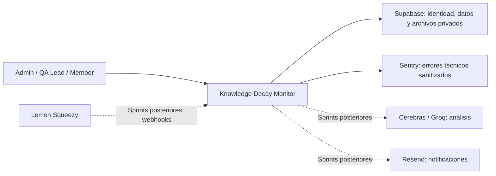
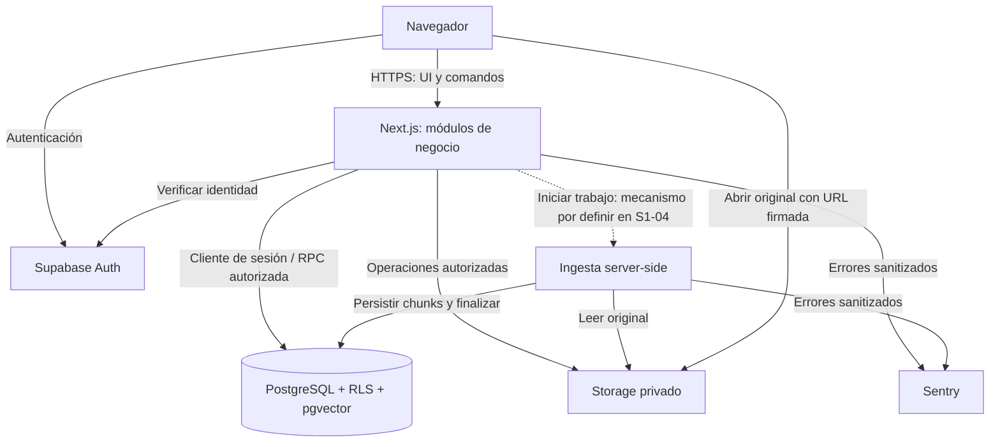
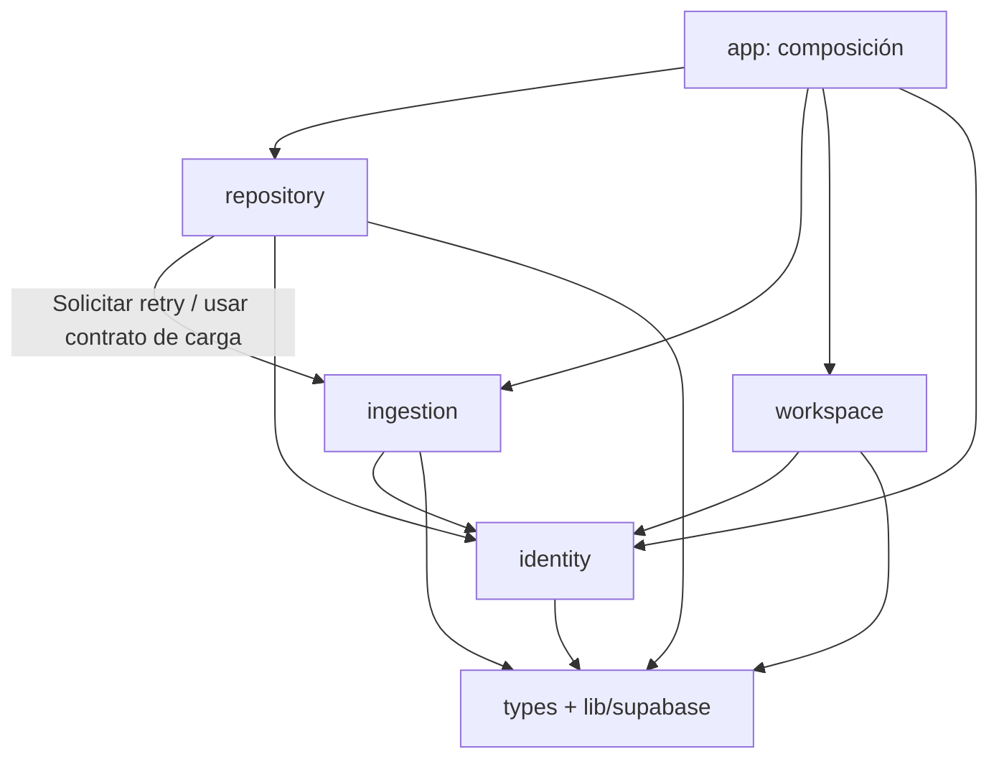
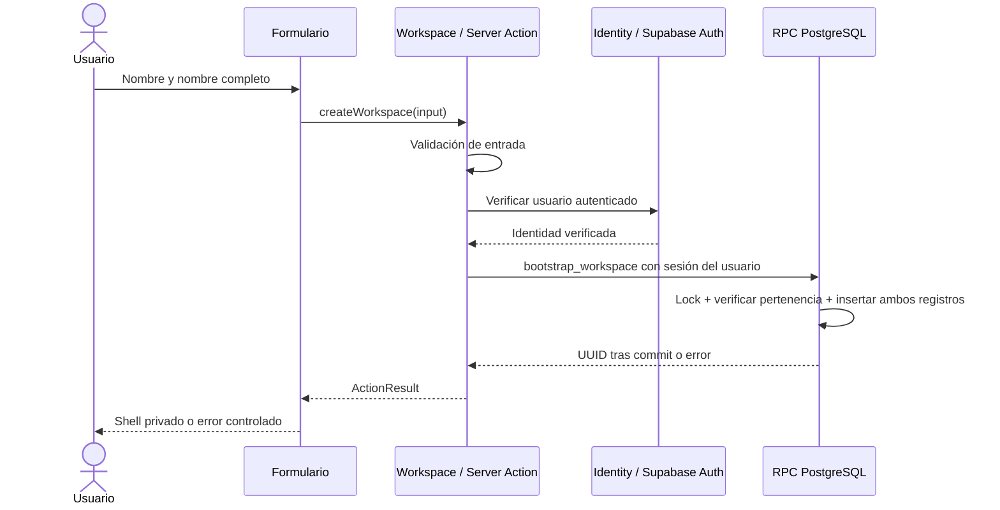

# Arquitectura base — Knowledge Decay Monitor

Fecha: 2026-09-26. Alcance: base común del MVP, con decisiones concretas para Sprint 1.

Este documento resuelve los ocho puntos de la actividad de [Arquitectura antes que código](arquitectura.md). Formaliza el monolito modular acordado en el [Día Cero](day-zero-protocol.md); no anuncia módulos ni flujos que todavía no existen.

**Cómo usarlo:** los tres desarrolladores deben leer las secciones 3–6 antes de implementar un ticket. Cada PR debe respetar los límites, el contrato y las invariantes que correspondan. Un cambio de decisión compartida se registra en un ADR y se coordina con los propietarios afectados antes de implementarlo.

Fuentes del proyecto:

- [PRD](../PRD/knowledge-decay-monitor-prd-final.md): comportamiento del producto y alcance de los sprints; especialmente §§13–15, 47–55 y 62–65.
- [Tickets de Sprint 1](../Tickets/tickets.md): criterios de aceptación S1-01 a S1-08.
- [Día Cero](day-zero-protocol.md): esquema, fixtures, ownership de archivos y reglas de integración.
- [Contratos TypeScript](../../src/types/contracts.ts), [tipos SQL](../../src/types/database.ts) y [migración inicial](../../supabase/migrations/00001_initial_schema.sql): contratos existentes.

Si estas fuentes discrepan, el equipo resuelve la discrepancia explícitamente y actualiza los artefactos afectados. Un documento nuevo no cambia silenciosamente el PRD ni una migración integrada.

## 1. Contexto

Knowledge Decay Monitor es un SaaS B2B para startups de tecnología que necesitan detectar contradicciones y obsolescencia en documentación interna privada. La IA propone hallazgos con evidencia; las personas deciden qué confirmar, corregir y aprobar. La interfaz del producto será en inglés; la documentación interna del equipo puede estar en español.

| Actor | Responsabilidad en el producto | Alcance inicial |
|---|---|---|
| Admin | Administra su workspace y sus documentos; posteriormente equipo y facturación | Registro, creación del workspace, carga y Repository |
| QA Lead | Gestiona documentación y revisión de calidad | Carga, Repository y retry; sin facultades exclusivas del Admin |
| Member | Atiende trabajo directamente asignado | Sin acceso a Repository durante S1; asignaciones en Sprint 3 |

Un usuario pertenece como máximo a un workspace. Entre registro y bootstrap todavía puede no tener Profile. El propietario de un documento (`owner_id`) no constituye una asignación de trabajo ni concede acceso de Member.



Los proveedores futuros provienen del PRD; no son dependencias que debamos integrar para arrancar S1. SMTP de Auth y notificaciones de negocio son necesidades distintas.

### Las cuatro fuerzas aplicadas al proyecto

| Fuerza | Situación | Decisión que orienta |
|---|---|---|
| Cambio | Ingesta, análisis y revisión llegan en distintos sprints | Separar por capacidades de negocio y evolucionar contratos pequeños |
| Complejidad | Tres desarrolladores, doce semanas y seis slices | Un repositorio y núcleo modular; funciones directas, sin capas ceremoniales |
| Equipo | Trabajo paralelo con esquema y configuración compartidos | Ownership del Día Cero, contratos versionados y PR pequeños |
| Riesgo | Documentación privada y cruces de tenant | Autorización en servidor, RLS, restricciones SQL y pruebas negativas |

La primera entrega funcional es un repositorio privado. Detectar contradicciones, cobrar créditos y gestionar correcciones son ampliaciones posteriores, no requisitos para declarar completo el Día Cero.

## 2. Contenedores principales y arquitectura física

Aquí **contenedor** significa unidad ejecutable o almacén de datos con responsabilidad propia, no necesariamente un contenedor Docker.

| Contenedor / sistema | Responsabilidad | Frontera y estado |
|---|---|---|
| Navegador | Interacción, formularios y presentación de estados | No confiable para rol, tenant, permisos ni resultados del procesamiento |
| Aplicación Next.js | Renderizado, Server Actions, validación y coordinación de casos de uso | Núcleo de aplicación en TypeScript; scaffold existente, casos de uso pendientes |
| Supabase Auth | Identidad, sesión, email/password y recuperación | Proveedor de identidad; no es la fuente de roles de negocio |
| PostgreSQL + pgvector | Datos, pertenencia, roles, RLS, invariantes y vectores | Esquema inicial existente; autoridad del estado persistido |
| Supabase Storage privado | Bytes de los archivos originales | Bucket y políticas existentes; acceso autorizado y URLs temporales |
| Ejecución de ingesta en servidor | Parsing, chunking, embeddings y finalización | Responsabilidad definida; runtime y mecanismo de ejecución pendientes de S1-04 |
| Sentry | Registro de fallos sin contenido privado ni secretos | Integración base existente; sanitización completa pendiente de S1-08 |



El diagrama describe responsabilidades objetivo; no afirma que el worker ya esté desplegado. Los comandos de negocio de la UI pasan por las acciones del servidor. Aunque un cliente evite esa UI y consulte la API de datos directamente, los permisos SQL y RLS deben seguir protegiendo los datos.

**Despliegue:** el PRD establece Vercel, Supabase y GitHub Actions. Para el MVP habrá un entorno compartido de desarrollo/pruebas/demo; no se exige staging separado. Los stacks locales descartables del Día Cero no reemplazan ese entorno ni autorizan resets sobre él. Los fixtures de Auth no se suben al proyecto compartido.

**Monolito modular no es sinónimo de monorepo.** El primero describe límites lógicos dentro de la aplicación; el segundo describe organización de repositorios y puede contener varios sistemas. Tampoco significa que navegador, PostgreSQL y Storage se ejecuten en un único proceso. Las Edge Functions futuras de análisis, purga y notificaciones previstas por el PRD no convierten cada módulo en un microservicio autónomo.

## 3. Módulos

Se mantienen los cuatro módulos del Día Cero. La siguiente es la estructura objetivo; no se crean carpetas vacías para simular avance.

```text
src/
  app/                     # Rutas y composición de presentación
  modules/
    identity/              # Identidad verificada y actor del workspace
    workspace/             # Workspace y pertenencia
    ingestion/             # Incorporación y procesamiento de documentos
    repository/            # Consulta y acceso a documentos
  lib/supabase/            # Clientes técnicos, sin reglas de negocio
  components/shell/        # Navegación y composición compartida
  types/
    database.ts            # Esquema SQL generado
    contracts.ts           # Acuerdos entre productores y consumidores
supabase/
  migrations/              # Esquema, RLS, restricciones y RPC
  tests/database/          # Pruebas reales de permisos e integridad
  seed.sql                 # Datos locales para trabajo independiente
```

Dentro de un módulo se crean archivos por necesidad: por ejemplo `actions.ts`, `queries.ts`, `schemas.ts` o `parse-markdown.ts`. No se obliga a crear cuatro carpetas application/domain/infrastructure/interface ni una clase por operación.

Los módulos futuros de análisis, revisión, créditos/pagos, notificaciones y purga se delimitan al llegar a sus slices. Esta lista reserva capacidades conceptuales, no interfaces ni infraestructura que deban construirse hoy.

## 4. Responsabilidad de cada módulo

| Módulo | Es responsable de | No debe asumir | Propietario |
|---|---|---|---|
| `identity` | Verificar sesión; resolver usuario; construir `Actor` desde Profile; autorización reutilizable | Crear automáticamente workspaces o confiar en un Actor recibido del navegador | Dev 1 |
| `workspace` | Bootstrap transaccional; pertenencia y roles; consultas necesarias de miembros | Parsing, versiones o UI del Repository | Dev 1 |
| `ingestion` | Validar carga; reservar documento/v1; almacenar original; extraer texto; generar chunks y vectores; ejecutar retry; activar v1 de forma atómica | Renderizar Repository, generar hallazgos IA o consumir créditos por upload | Dev 2 |
| `repository` | Listar, buscar por nombre y filtrar; mostrar estados; autorizar apertura del original; solicitar retry a ingesta | Escribir chunks, ejecutar parsing o modificar estados de procesamiento directamente | Dev 3 |

**Persistencia compartida con responsabilidad explícita:** `workspace` controla escrituras de `workspaces` y `profiles`; `ingestion`, la creación y procesamiento de `documents`, `document_versions`, `document_chunks` y los originales. `repository` es consumidor de lectura de esas estructuras y puede unir metadata de Profile para mostrar Owner. Esto es un acoplamiento de lectura al esquema compartido, aceptado y versionado; no concede permiso para cambiar tablas ajenas.

Dev 1 coordina migraciones y tipos compartidos, pero no implementa toda la lógica de los demás dominios. Cada autor mantiene las reglas de su módulo. La [matriz detallada de archivos](day-zero-protocol.md#matriz-de-propiedad) conserva la distribución del Día Cero.

### Separación lógica de responsabilidades

| Responsabilidad | Ubicación normal | Ejemplo |
|---|---|---|
| Presentación | `src/app` y componentes del módulo | Mostrar que un archivo está procesándose |
| Caso de uso | Función pública/Server Action del módulo | Autorizar y coordinar una carga |
| Regla de negocio | Función del módulo y/o restricción SQL si es una invariante persistida | Una versión fallida no puede ser activa |
| Integración técnica | Código próximo al módulo y clientes compartidos | Leer un original de Storage |

Son responsabilidades, no cuatro llamadas obligatorias. Una operación pequeña puede validarse y ejecutar una consulta directa en una función. Se extrae una unidad cuando tiene una responsabilidad comprobable, no para añadir forwarding.

## 5. Dependencias permitidas

La flecha indica **quién puede depender de quién**, no el recorrido de un request.



Reglas para los PR:

1. Entre módulos solo se importa desde su interfaz pública (`index.ts`, cuando exista) y contratos. Se puede reexportar una función existente; no envolverla en otra clase solo para cumplir esta regla.
2. No se permiten dependencias de `identity` hacia `workspace`, de `ingestion` hacia `repository`, ni ciclos. `identity` lee la pertenencia persistida sin invocar el módulo `workspace`.
3. `src/lib/supabase` no importa módulos ni contiene reglas de roles, estados, créditos o negocio. Los tipos compartidos no importan implementaciones.
4. Los componentes cliente solo consumen DTO, componentes seguros para cliente y puntos de entrada de servidor. Nunca importan clientes privilegiados, parsers o lógica de worker a través de un barrel mixto.
5. Repository puede leer proyecciones de documentos/versiones/Owner mediante el cliente de sesión y RLS. No necesita una API HTTP interna ni un repositorio genérico para cada tabla. Sus escrituras de negocio se solicitan al módulo propietario.
6. La búsqueda de S1 es por nombre y filtros, no semántica. Se consulta también la última versión cuando el puntero activo es NULL, para no ocultar documentos en procesamiento o fallidos.
7. Las llamadas internas del núcleo son funciones, no HTTP entre módulos. HTTP se usa en fronteras reales: navegador, servicios administrados y ejecutores separados cuando se definan.
8. Migraciones, tipos y contratos cambian coordinadamente. Un tipo SQL no valida input ni autoriza una operación. Zod valida datos en las fronteras; los permisos se vuelven a comprobar en servidor y base.

### Invariantes compartidas

- Tenant y rol se derivan de identidad verificada y Profile persistido, nunca de `workspaceId`, `role` o metadata editable enviados por el cliente.
- RLS y GRANT explícitos protegen las tablas expuestas. Una clave de servicio evita RLS y exige validar el contexto antes de ejecutar trabajo privilegiado; nunca llega al navegador. Esta separación coincide con la [documentación oficial de RLS](https://supabase.com/docs/guides/database/postgres/row-level-security).
- Originales privados; rutas resueltas desde la versión autorizada; expiración de la URL firmada de la aplicación: 300 segundos. No registrar ni persistir esa URL.
- La carga acepta PDF textual, DOCX y Markdown; máximo 10 archivos y 10 MiB por archivo según el acuerdo del Día Cero. MIME declarado no reemplaza validación de contenido.
- Procesamiento: `uploaded → processing → ready | processing_failed`. Una versión no procesada no tiene estado funcional; v1 se activa después de persistir el procesamiento completo y actualizar el puntero en la misma transacción.
- Storage y PostgreSQL no forman una única transacción. Ingesta debe compensar fallos y definir recuperación de reservas u objetos huérfanos. Dos requests REST independientes no equivalen a una transacción SQL de activación.
- Retry conserva identidad del documento y versión, reautoriza y controla concurrencia. Ni upload ni retry consumen créditos de análisis.
- Los logs contienen errores técnicos sanitizados, no documentos, chunks, tokens, secretos ni respuestas crudas de proveedores.

## 6. Contrato de una operación: crear Workspace

Se elige esta operación porque cruza navegador, identidad, aplicación, transacción y aislamiento, y ya tiene una base SQL en el Día Cero. Corresponde a **S1-01**, con controles de S1-02 y S1-08.

| Elemento | Contrato |
|---|---|
| Operación | `WorkspaceApi.createWorkspace(input)`; comando implementado como Server Action |
| Entrada | `CreateWorkspaceInput`: `{ name: string; fullName: string }` |
| Salida | `Promise<ActionResult<{ workspaceId: string }>>` |
| Autenticación | Sesión válida de Supabase Auth, verificada del lado servidor |
| Autorización | Usuario sin Profile/workspace previo; el cliente no elige rol ni tenant |
| Persistencia | RPC existente `bootstrap_workspace(workspace_name, full_name)` con identidad del usuario |
| Efectos | Crear un Workspace y su Profile Admin, o no crear ninguno |
| Transporte | Server Action; no se congela una URL interna generada ni se introduce un endpoint REST adicional |
| Responsable | Dev 1; consumidores importan los contratos de `src/types/contracts.ts` |

Ejemplo de input:

```json
{ "name": "Acme Engineering", "fullName": "Alex Rivera" }
```

Ejemplo de éxito:

```json
{ "ok": true, "data": { "workspaceId": "aaaaaaaa-aaaa-4aaa-8aaa-aaaaaaaaaaaa" } }
```

Ejemplo de conflicto:

```json
{ "ok": false, "error": { "code": "CONFLICT", "message": "You already belong to a workspace." } }
```

### Validación y ejecución

1. Validar forma de entrada y nombres: aplicar trim, exigir 1–120 caracteres y rechazar campos inesperados como `workspaceId`, `userId`, `role` o `email`. Zod se comparte con la validación del formulario; el servidor siempre repite la validación. La RPC tiene además sus propias restricciones SQL.
2. Verificar la identidad de Auth. **No llamar a `requireActor()` como prerrequisito del bootstrap:** ese contrato requiere un Profile, precisamente el registro que todavía vamos a crear. Identity debe distinguir usuario autenticado de actor con workspace. Su mecanismo concreto de verificación se implementa en S1-01.
3. Mapear `name → workspace_name`, `fullName → full_name` y llamar la RPC usando la sesión del usuario; no usar la clave de servicio para simularlo.
4. La RPC obtiene el email de `auth.users`, bloquea la fila del usuario, comprueba pertenencia y crea Workspace + Profile Admin en una transacción. El bloqueo serializa solicitudes para el mismo usuario.
5. Devolver éxito solo tras confirmar la transacción. La UI actualiza su contexto y navega al shell privado. Esa navegación es presentación, no parte del contrato SQL.

### Errores e invariantes

| Condición | Código de aplicación | Comportamiento |
|---|---|---|
| Sesión ausente o no válida | `UNAUTHENTICATED` | No crear registros; solicitar login |
| Datos inválidos | `INVALID_INPUT` | No crear registros; mostrar error controlado |
| Ya pertenece a un workspace | `CONFLICT` | No crear un segundo workspace |
| Identidad autenticada no autorizada para la operación | `FORBIDDEN` | Rechazar sin exponer datos internos |
| Error técnico o resultado de red incierto | `INTERNAL_ERROR` | No afirmar éxito ni mostrar SQL/stack traces; registrar error sanitizado |

La RPC usa `22023` para nombres inválidos, `23505` para pertenencia existente y `42501` para las condiciones de identidad/autorización de su cuerpo. El adaptador interpreta esos errores en el contexto de esta operación; no convierte cualquier `23505` de cualquier consulta en el mismo mensaje.

La operación no es una API idempotente que siempre devuelva el mismo éxito: una segunda solicitud produce conflicto. Si se pierde la respuesta después de un commit, consultar el Profile propio y recuperar el contexto antes de reintentar. El esquema evita crear dos workspaces para el mismo usuario por solicitudes concurrentes de bootstrap; falta aún una prueba concurrente de integración.



**Estado:** firma TypeScript y RPC existentes; Server Action, Zod, UI y E2E por implementar. Los ejemplos definen el comportamiento que debe entregarse, no endpoints ya operativos.

## 7. ADR-001

La decisión se registra en [ADR-001 — Monolito modular con persistencia compartida y aislamiento por workspace](adr/ADR-001-monolito-modular.md).

Decisión central: núcleo Next.js organizado por capacidades de negocio, contratos explícitos, persistencia Supabase compartida y aislamiento obligatorio en base de datos. Se mantiene la separación lógica del Día Cero, sin introducir microservicios por desarrollador ni capas genéricas redundantes.

El ADR contiene problema, decisión, alternativas, justificación y consecuencias aceptadas. No decide por anticipado el runtime de ingesta ni afirma que las Edge Functions futuras ya estén construidas.

## 8. Walking Skeleton

El Walking Skeleton será la primera demostración funcional de que UI, identidad, lógica de aplicación y persistencia protegida colaboran de extremo a extremo. **El seed y las pruebas del Día Cero preparan esa demostración, pero no la sustituyen.**

### Primer recorrido mínimo: S1-01 + S1-02

```text
Registro email/password → login → crear workspace → Profile Admin
→ shell privado muestra el workspace persistido → recargar conserva contexto
```

Debe ejecutarse desde el navegador con un usuario nuevo, sin insertar su Profile manualmente ni usar la cuenta Admin del seed para saltarse el flujo.

| Paso | Responsable | Evidencia de salida |
|---|---|---|
| Arrancar local y aplicar Día Cero | Los tres; Dev 1 coordina | Base reproducible y pruebas SQL/HTTP de fixtures verdes |
| Conectar registro/login y verificación de sesión | Dev 1 | Usuario real de Auth; rutas privadas rechazan sesión ausente |
| Implementar el contrato de la sección 6 | Dev 1 | Un Workspace y un Admin; repetición rechazada sin duplicados |
| Mostrar workspace en shell protegido | Dev 1 | La UI lee datos persistidos y conserva contexto al recargar |
| Probar usuario/tenant B y manipulación de IDs | Dev 1, revisión conjunta | Ni UI ni request directo exponen el tenant ajeno |
| Automatizar recorrido | Dev 1 | Playwright desde registro hasta shell y pruebas negativas de RLS |

Un mock de sesión o un workspace hardcodeado no cumple el criterio. Tampoco basta con un health check o una prueba de la RPC aislada.

### Ampliación al slice de documentos

En cuanto el primer recorrido funcione, conectar la parte de Dev 2 y Dev 3 con un Markdown pequeño real:

```text
Admin autenticado → upload con metadata → original privado + documento/v1
→ processing → parsing/chunks/embeddings reales → ready + active atómicos
→ Repository → abrir original con URL firmada
```

Dev 2 entrega reserva, carga, procesamiento y finalización; Dev 3 compone upload/Repository y apertura segura. El primer camino puede usar un archivo Markdown y UI mínima. Para cerrar Sprint 1 siguen siendo obligatorios PDF textual, DOCX, filtros, recuperación de contraseña, retry, manejo de errores y todos los demás criterios de S1-01 a S1-08.

Pruebas de salida del slice: rechazar Owner de otro tenant, impedir lectura/firma cross-tenant y acceso de Member, mostrar una versión fallida sin activarla y ejecutar retry conservando documento/versión. El pipeline debe usar embeddings reales; los vectores sintéticos del seed no constituyen evidencia de procesamiento.

### Decisiones de ejecución que se deben cerrar antes de S1-04

La base común fija el comportamiento, pero el Día Cero no eligió el runtime del procesador. Dev 2 propone y Dev 1 revisa la opción concreta antes de integrarla; Dev 3 consume el contrato sin depender de esa elección.

| Decisión | Evidencia para resolverla | Momento límite |
|---|---|---|
| Runtime de parsing y embeddings | Compatibilidad real con PDF/DOCX/Markdown y `gte-small`; límites de tiempo/memoria para archivos permitidos | Antes del primer pipeline real |
| Disparo y recuperación del trabajo | Cómo se inicia, se evita doble ejecución y se recupera una interrupción sin depender de que el navegador siga abierto | Antes de integrar procesamiento/retry |
| Finalización transaccional | Operación que persiste chunks y estados/puntero de manera consistente; prueba de fallo | Antes de declarar v1 `ready` |
| Compensación de upload | **Cerrada en S1-03**: Día Cero no otorga `DELETE` sobre `documents` ni `document_versions`, así que una reserva huérfana no se deshace. La limitación se declara (el Repository muestra el documento con `processing_status = uploaded` sin objeto); S1-07 lo marcará `processing_failed`; el cierre real llega con el Purge Worker en Sprint 5. Ver spec S1-03 §10.1. | Cerrada |

No se promete una cola durable, un scheduler, Realtime o un worker desplegado que aún no existen. La elección debe documentarse con su evidencia y, si altera límites o despliegue, mediante otro ADR. Replace File conserva la ambigüedad identificada en S1-07; no se implementa una semántica por suposición.

### Qué existe y qué falta

| Entrega | Estado al redactar este documento |
|---|---|
| Esquema, RLS, seed, Storage local y contratos de tipos | Archivos existentes del Día Cero |
| Validación del Día Cero | Evidencia registrada el 2026-09-25: 78 pruebas SQL, comprobaciones HTTP, TypeScript y lint; no se reejecutaron para esta documentación |
| Módulos y dependencias descritos aquí | Base de diseño para implementar tickets; sin mecanismos automáticos nuevos de enforcement |
| Auth/Workspace desde navegador | Walking Skeleton pendiente |
| Upload/procesamiento/Repository desde navegador | Slice pendiente |
| GitHub Actions y controles obligatorios de integración | S1-08 pendiente; acordar personas reales para los roles Dev 1/2/3 |

Consultar la [evidencia del Día Cero](day-zero-verification.md) y su [guía operativa](day-zero-protocol.md#4-guía-de-arranque-día-cero--cinco-pasos) para preparar el entorno. Esta actividad es documental: no requiere crear servicios externos ni modificar la base existente.
