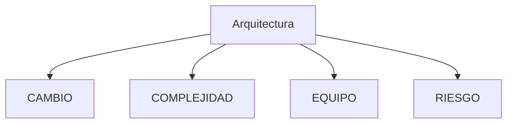
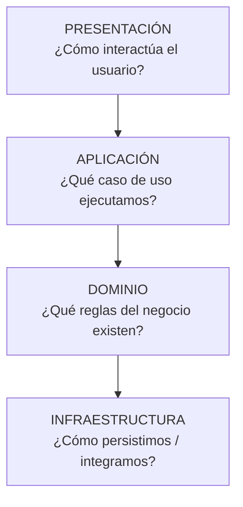
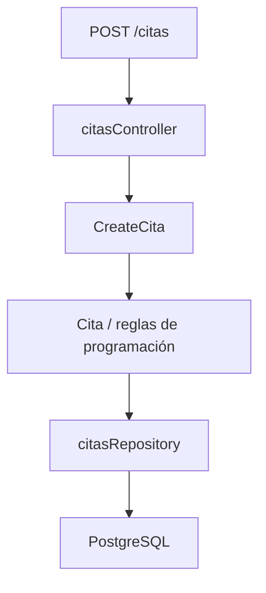
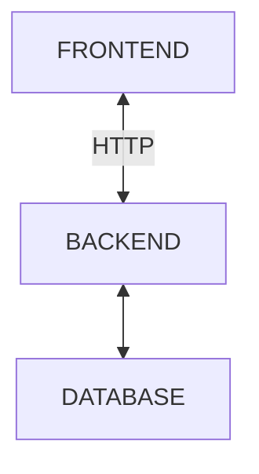
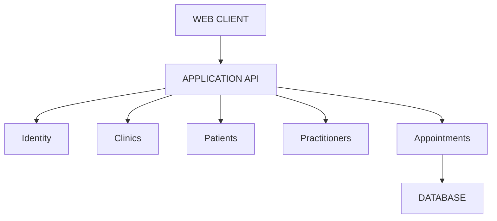
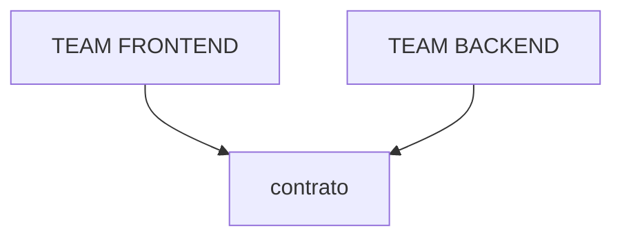
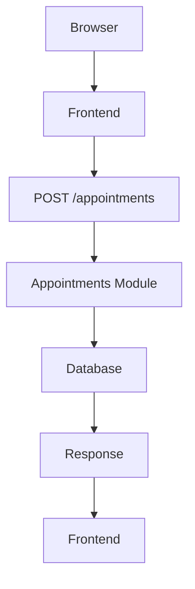

# ARQUITECTURA ANTES QUE CÓDIGO

**SaaS - 2026 II**  
**Ing. Mateo Echeverry Correa**

---

## ¿QUÉ ES ARQUITECTURA?

Arquitectura es el conjunto de decisiones que define cómo dividimos el sistema, qué responsabilidades tiene cada parte y cómo permitimos que esas partes colaboren.

> **Arquitectura = decisiones sobre la estructura del sistema y las relaciones entre sus partes.**

---

## ¿Tienen la misma arquitectura?

| SISTEMA A | SISTEMA B |
|---|---|
| REACT | REACT |
| FASTAPI | FASTAPI |
| POSTGRESQL | POSTGRESQL |

**¿Tienen la misma arquitectura?**

---

## LAS 4 FUERZAS DE LA ARQUITECTURA



---

## LA SEPARACION DE RESPONSABILIDADES

La recepcionistas de la clinica intenta crear una cita, parece una operacion pequeña ... pero, ¿Qué pasa realmente?

**¿Todo ese proceso lógico puede ocurrir en un solo lugar ?**

---

## LA SEPARACION DE RESPONSABILIDADES

```text
CitasController
├─ valida HTTP
├─ consulta PostgreSQL
├─ calcula disponibilidad
├─ envía email
├─ genera PDF
├─ valida permisos
├─ registra auditoría
└─ devuelve JSON
```

**¿Qué pasa si alguno de esos elementos cambia?**

---

## LA SEPARACION DE RESPONSABILIDADES

A esta Arquitectura se le conoce como **capas**.



---

## LA SEPARACION DE RESPONSABILIDADES

A esta Arquitectura se le conoce como **capas**.



---

## PERO TAMPOCO HAY QUE ABUSAR

```text
Controller
↓
Service
↓
Manager
↓
Handler
↓
Provider
↓
Repository
↓
DAO
↓
Database
```

**¿Estamos separando responsabilidades o solamente creando archivos?**

La abstracción tiene un costo.

> Importantisimo con la IA, porque los agentes tienden a generar sobrearquitectura cuando se les pide “best practices”.

---

## ARQUITECTURA FÍSICA VS ARQUITECTURA LÓGICA

Esto describe principalmente grandes límites del sistema.



---

## ARQUITECTURA ORIENTA A SERVICIOS

Un servicio expone una capacidad mediante un contrato definido.

- Appointments Service
- Patients Service
- Identity Service
- Notifications Service

Cada servicio cuenta con:

> **CAPACIDAD + CONTRATOS + RESPONSABILIDAD**

---

## ARQUITECTURA ORIENTA A SERVICIOS

Pensar en servicios significa pensar en límites y contratos. No significa automáticamente:

- contenedor
- Kubernetes
- microservicio
- repositorio separado

---

## ACOPLAMIENTO

### FUERTE

```text
Appointments
↓
conoce tablas internas de Patients
↓
modifica directamente sus datos
```

### DEBIL

```text
Appointments
↓
Patient Contract
↓
Patients
```

---

## MONOLITO MODULAR

También conocido como **MONOREPO**.

### Modular Monolith

```text
┌────────────────────────────────────┐
│             Appointments           │
│                                    │
│  Patients        Practitioners     │
│                                    │
│  Identity                          │
│                                    │
│          Notifications             │
└────────────────────────────────────┘
             ONE DEPLOYMENT
```

### Enfoque tecnico (capas)

```text
controllers/
services/
repositories/
entities/
```

### Enfoque modular

```text
appointments/
├─ application/
├─ domain/
├─ infrastructure/
└─ interface/
```

> **Los módulos deberían representar cosas que el negocio reconoce.**

---

## UN PEQUEÑO EJEMPLO



---

## CONTRATOS

Un contrato describe:

- endpoint / operación;
- input;
- output;
- errores;
- autenticación;
- invariantes importantes.



---

## DECISIONES ARQUITECTONICAS

Todas las decisiones arquitectonicas deben resolver las siguientes preguntas:

1. ¿QUÉ PROBLEMA TENÍAMOS?
2. ¿QUÉ DECIDIMOS?
3. ¿QUÉ ALTERNATIVAS CONSIDERAMOS?
4. ¿POR QUÉ?
5. ¿QUÉ CONSECUENCIAS ACEPTAMOS?

- formato ADR
- prompt refinado

---

## EL WALKING SKELETON

La implementación mínima que demuestra que las piezas fundamentales de nuestra arquitectura pueden trabajar juntas de extremo a extremo.

### No buscamos todavía

- UI perfecta
- todas las reglas
- todas las funcionalidades.

### Buscamos demostrar

**el camino completo funciona.**



---

## ACTIVIDAD

Como Cada equipo hizo el trabajo de las historias de usuario, tenemos el insumo necesario para generar:

1. Contexto
2. Contenedores principales
3. Módulos
4. Responsabilidad de cada módulo
5. Dependencias permitidas
6. Contrato de una operación
7. ADR-001
8. Walking Skeleton

---

# Muchas Gracias

**BUENA ARQUITECTURA no significa:**

> "muchas tecnologías"

**significa:**

> "límites claros  
> responsabilidades claras  
> contratos claros  
> decisiones explícitas"
