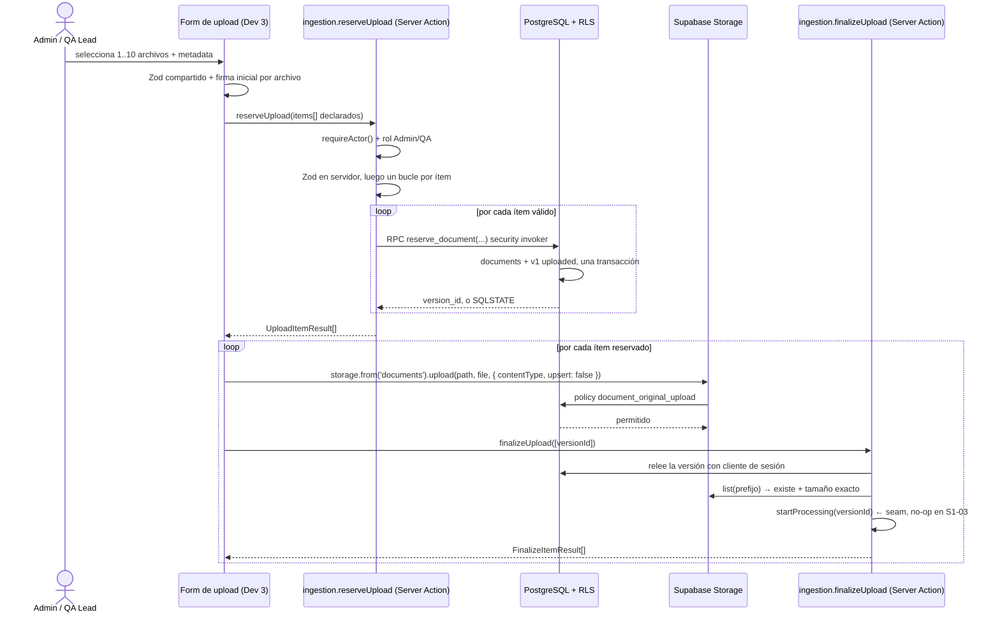

# S1-03 — Especificación de la carga privada de documentos

**Ticket:** S1-03 — Carga privada de documentos con metadata y validaciones
**Responsable:** Dev 2 (módulo `ingestion`)
**Estado:** diseño aprobado en revisión conjunta; pendiente de integración
**Fecha:** 2026-09-27
**Depende de:** [day-zero-protocol.md](../../architecture/day-zero-protocol.md), [arquitectura-base.md](../../architecture/arquitectura-base.md), [ADR-001](../../architecture/adr/ADR-001-monolito-modular.md), [tickets.md](../../Tickets/tickets.md) §S1-03, PRD §§10, 11, 12, 13, 46, 50

---

## 1. Propósito y alcance

Este documento especifica cómo se implementa S1-03. No implementa S1-04 ni ninguna funcionalidad posterior.

**Entrega de Dev 2:**

- El módulo `src/modules/ingestion/**` con su interfaz pública.
- Los esquemas Zod compartidos que el formulario de Dev 3 reutiliza.
- La migración de la RPC `reserve_document`.
- Las pruebas unitarias y SQL de su módulo.

**No es entrega de Dev 2:** la página de upload. La matriz de propiedad asigna `src/app/(workspace)/repository/**` a Dev 3, y [arquitectura-base.md §8](../../architecture/arquitectura-base.md) establece que "Dev 3 compone upload/Repository". La sección 15 define qué necesita Dev 3 para componerla sin adivinar.

### 1.1 Fuera de alcance

| Fuera | Pertenece a |
|---|---|
| Parsing, chunking, embeddings, activación de v1 | S1-04 |
| Retry de processing | S1-07 |
| Repository, búsqueda, filtros | S1-05, S1-06 |
| Apertura del original con URL firmada | Dev 3, S1-05 |
| Playwright `upload → processing → repository → secure open` | Dev 3, S1-05 |
| Errores de Sentry y quality gates de CI | S1-08 |
| Borrado permanente y Purge Worker | Sprint 5 |

---

## 2. Contexto y restricciones

### 2.1 Restricción de despliegue

Los bytes del archivo **no pueden atravesar el proceso de Next.js** en el entorno de despliegue que exige el PRD.

- **Vercel Functions** limita el body de la petición a **4.5 MB** y devuelve `413 FUNCTION_PAYLOAD_TOO_LARGE`. Ese límite no es configurable y aplica por igual a Server Actions y Route Handlers.
- **Server Actions** tienen además `serverActions.bodySizeLimit` con un valor por defecto de **1 MB**, configurable en `next.config.ts`, que es propiedad exclusiva de Dev 1.

El ticket S1-03 exige **10 MiB por archivo**, muy por encima de ambos topes. Por tanto la carga es directa del navegador al bucket privado de Supabase Storage, usando el JWT del usuario. Esto no es una optimización: es la única topología que satisface el ticket en el hosting del PRD.

### 2.2 Restricción del esquema

El `CHECK constraint storage_path_matches_identity` de [`00001_initial_schema.sql`](../../../supabase/migrations/00001_initial_schema.sql) exige que la ruta sea exactamente:

```text
<workspace_id>/<document_id>/<version_id>/original.<ext>
```

Las filas de `documents` y `document_versions` deben existir **antes** de subir un byte. La policy `document_original_upload` exige que exista una versión registrada cuya `storage_path` coincida exactamente, con el tenant y el rol correctos. De ahí el orden reserva → carga → cierre.

### 2.3 Límites numéricos

| Límite | Valor | Fuente |
|---|---|---|
| Tamaño máximo por archivo | **10 485 760 bytes** (10 MiB) | `file_size_limit` del bucket, congelado en Día Cero |
| Archivos por lote | 1 a 10 | PRD §10 |
| Longitud del nombre | 1 a 200 caracteres tras `btrim` | `CHECK` de `documents.name` |
| Longitud de la ruta de Storage | derivada, nunca aportada por el cliente | `CHECK storage_path_matches_identity` |

El PRD y el ticket dicen "10 MB". La implementación usa 10 485 760 bytes, que es el file_size_limit del bucket creado en Día Cero. Se conserva la nomenclatura "MB" del ticket y del PRD, con el valor binario fijado en 10 485 760 bytes (10 MiB) y no se reinterpretará.

---

## 3. Decisiones

| # | Decisión | Alternativas descartadas | Consecuencia aceptada |
|---|---|---|---|
| D1 | Reserva en servidor + carga directa del navegador a Storage | Server Action con `FormData` completo; Route Handler multipart | Dos pasos de red; los bytes no tocan Next.js |
| D2 | Flujo de tres pasos con `finalizeUpload` | Dos pasos, con verificación posterior | Un paso más a cambio de un punto de cierre en el servidor |
| D3 | Se declara el seam `startProcessing`; lo implementa S1-04 | S1-03 no invoca nada; S1-03 implementa pipeline mínimo | En S1-03 la v1 queda en `uploaded`, que es lo que el ticket pide |
| D4 | Validación de hechos declarados en S1-03; el contenido lo valida el parser de S1-04 | Verificación estricta con columna `source_signature` y lectura `Range` | Un archivo mal renombrado se detecta en S1-04, no en S1-03 |

D1 está forzada por §2.1. D2 existe porque S1-04 exige que el procesamiento arranque en el servidor tras una carga válida, y porque la compensación de reservas necesita un punto de cierre. D3 hace visible la frontera sin fingir trabajo hecho. D4 es la decisión más discutible del documento y su coste está explícito abajo.

### 3.1 Por qué D4 y no la verificación estricta

Con carga directa, el servidor no ve los bytes. Una firma de los primeros 8 bytes solo distingue parte de los formatos:

| Formato | Qué prueba el prefijo | Fuerza |
|---|---|---|
| PDF | `%PDF-` en los primeros bytes | Fuerte |
| DOCX | `PK\x03\x04`, idéntico a cualquier ZIP | Débil |
| Markdown | no aplica; no hay magic bytes | Nula |

La verificación estricta añadiría una columna `source_signature`, una lectura acotada con `Range` fuera del SDK de Supabase y un modo de fallo nuevo, y aun así no distinguiría un DOCX de un ZIP ni diría nada sobre el contenido de un Markdown. El parser de S1-04 ya descarga el original para extraer texto y puede rechazar cualquier formato no parseable con `processing_failed`, que es el comportamiento que el PRD diseñó. Pagar una columna y un `fetch` crudo por una detección que llega un sprint más tarde no compensa.

**Lo que S1-03 sí hace con la firma:** la comprueba **en memoria**, contra el prefijo esperado de la extensión declarada, y rechaza la incoherencia obvia. No se persiste. El spec la declara explícitamente como *no control de seguridad*: un cliente puede mentir, y por eso no se persiste ni se confía en ella.

Que sea obligatoria en el contrato (§5.2) y que no sea un control de seguridad son dos cosas distintas, y conviene no confundirlas. *Obligatoria* es una decisión de ergonomía: hace que la comprobación exista siempre en lugar de depender de que un cliente se acuerde. *No control de seguridad* describe su fuerza: aunque llegue, un cliente podría falsearla, y por eso S1-03 no toma ninguna decisión de seguridad a partir de ella. La seguridad del original descansa en la policy `document_original_upload` y, a partir de S1-04, en el parser.

---

## 4. Arquitectura y flujo



### 4.1 Privilegios por paso

| Paso | Actor | Cliente | Privilegio | Toca |
|---|---|---|---|---|
| `reserveUpload` | Servidor | **sesión** | RLS: `document_insert`, `version_reserve` | `documents`, `document_versions` |
| `upload()` | Navegador | **sesión** | RLS: `document_original_upload` | `storage.objects` |
| `finalizeUpload` | Servidor | **sesión** | RLS: `document_original_read` | `storage.objects`, solo lectura |

**Ningún paso de S1-03 usa clave de servicio.** Las policies de Día Cero ya permiten a un Admin o QA Lead operar sobre una versión registrada de su tenant. S1-04 sí necesitará `SUPABASE_SERVICE_ROLE_KEY`, porque escribir chunks y activar la v1 está reservado al backend privilegiado.

**El guard de rol no es redundante con RLS, y hay que entender por qué.** RLS en Día Cero discrimina por **tenant**, no por rol: un `Member` de Workspace A lee y escribe las filas de su propio Workspace A igual que un Admin. Por eso el guard explícito `role !== "Admin" && role !== "QA Lead"` existe en las dos Server Actions. En `reserveUpload` la RLS lo habría frenado igual, por `document_insert`; en `finalizeUpload` **no**: la versión existe, es del tenant del Member, y la comprobación tendría éxito. Sin el guard, un Member podría cerrar la reserva de otro y la acción respondería `ok: true`. El guard no duplica una defensa de base de datos, compensa el hecho de que la base de datos no tiene una regla de rol aquí.

### 4.2 Estados de una versión durante S1-03

| Campo | Valor en S1-03 | Lo fija |
|---|---|---|
| `processing_status` | `uploaded` | default de la tabla |
| `version_status` | `NULL` | `CHECK unprocessed_version_has_no_functional_status` |
| `analysis_status` | `pending_reanalysis` | default de la tabla |
| `version_number` | `1` | `WITH CHECK` de la policy `version_reserve` |
| `documents.active_version_id` | `NULL` | `WITH CHECK` de la policy `document_insert` |

S1-03 no escribe `document_chunks` y no toca créditos: no existe todavía la tabla `credit_ledger`, y el upload es gratuito por PRD §13.

### 4.3 `finalizeUpload` es de solo lectura en S1-03

No escribe nada. Existe por tres razones: confirmar en el servidor lo que el navegador afirma; ser el **punto de llamada que S1-04 sustituye sin tocar `actions.ts`**; y dar a la UI un veredicto por archivo en vez de una promesa del cliente.

**Lo que comprueba y lo que no.** La verificación es `storage.from('documents').list(prefijoDeLaVersion)`, que devuelve nombre y tamaño del objeto. El prefijo sale de `storage_path`, que compuso la RPC en la reserva (§7.3) y que el servidor solo lee. Sobre eso hay exactamente dos preguntas: ¿existe un objeto en la ruta que la RPC calculó? ¿mide lo que se declaró en la reserva? Son **comprobaciones de cordura**, y conviene decir sin rodeos lo que no son:

- No es una garantía criptográfica del contenido. Un objeto en esa ruta con ese tamaño puede contener cualquier cosa.
- No verifica que los bytes sean los que el cliente pretendía subir. Solo que *algo* llegó.
- No valida que el archivo sea un PDF o un DOCX real. `list()` lee metadatos del objeto, no sus bytes.

Para responder a eso hace falta abrir el objeto y mirar su contenido, y eso lo hace el parser de S1-04 con cliente privilegiado (§3.1). En S1-03 la firma de §7.2 es la única lectura de bytes del archivo, y ocurre en el navegador, antes de subir.

El valor de esta comprobación es operativo, no de seguridad: convierte un `upload()` que el navegador dio por bueno en un hecho verificado en el servidor, de modo que la UI no muestra documentos con `processing_status = uploaded` y sin original detrás. Cierra la pregunta «¿llegó la subida?», no «¿es el archivo que dice ser?».

Que un atacante que ya puede escribir en el bucket pueda satisfacer existencia y tamaño con contenido arbitrario no es un riesgo entre tenants: la policy `document_original_upload` exige que exista la fila de `document_versions` de su propio tenant, así que solo podría falsear su propia carga.

### 4.4 Orden canónico en el cliente

`reserveUpload` se llama **una vez por lote**, para que el servidor valide el límite de 1 a 10 y cada ítem en un solo viaje de red. Después el cliente recorre los ítems reservados uno a uno: `upload` y después `finalizeUpload([versionId])` de ese mismo ítem, antes de pasar al siguiente.

Este orden es la razón por la que la reserva huérfana de la sección 10 es un problema acotado: la ventana sin cubrir es de milisegundos y afecta a un solo archivo, no a los diez.

`finalizeUpload` acepta un array porque el contrato es el mismo tanto para un ítem como para varios, y porque un cliente con buena red puede cerrar varios ítems en un solo viaje si esa decisión suya reduce su latencia percibida. El servidor devuelve un `FinalizeItemResult` por `versionId` recibido, en el mismo orden, y nunca acepta un `versionId` que no sea de su tenant.

---

## 5. Contrato público

Archivo: [`src/types/contracts.ts`](../../../src/types/contracts.ts), propiedad de Dev 1. **Cambio de contrato, no aditivo.** Dev 2 lo redacta, Dev 1 lo coordina, Dev 3 lo revisa antes de integrar.

### 5.1 Adición: nombrar el código de error

Hoy el código de error está inline dentro de `ActionResult`. Se extrae para reutilizarlo en los resultados por archivo:

```ts
export type ActionErrorCode =
  | "UNAUTHENTICATED"
  | "FORBIDDEN"
  | "INVALID_INPUT"
  | "NOT_FOUND"
  | "CONFLICT"
  | "PROCESSING_FAILED"
  | "INTERNAL_ERROR";
```

`ActionResult<T>` pasa a usar `ActionErrorCode` en lugar de la unión literal. No cambia su forma ni sus variantes.

**Los siete códigos entran ahora, incluidos `CONFLICT` y `PROCESSING_FAILED`, que S1-03 no emite.** No es una decisión de taste: los siete ya están en `contracts.ts` hoy, y extraer el nombre no añade ni quita ninguna variante, solo cambia cómo se escribe. Dejarlos fuera crearía un tipo cuyo propósito es nombrar la unión de `ActionResult` y que además la describe incompleta, obligando a un segundo cambio más adelante. Una unión de literales es aditiva por naturaleza: mientras no se emita el código, ningún consumidor lo observa.

### 5.2 Reemplazo: `IngestionApi`

```ts
/** Hechos declarados del archivo. El servidor nunca recibe los bytes en S1-03. */
export interface UploadItemInput {
  metadata: UploadMetadata; // { name, category, ownerId } — sin cambios
  /** Solo se usa para derivar la extensión validada y para diagnóstico. */
  fileName: string;
  declaredMimeType: string;
  sizeBytes: number;
  /**
   * Obligatoria. Primeros 8 bytes del archivo en base64: 11 caracteres de datos
   * y un `=`. Verificada en memoria, nunca persistida. No es un control de
   * seguridad (§3.1) — es una comprobación de cordura que evita subir 10 MiB
   * de un archivo mal etiquetado.
   */
  signature: string;
}

export interface UploadItemResult {
  index: number;
  outcome:
    | {
        ok: true;
        documentId: string;
        versionId: string;
        /** <workspace>/<document>/<version>/original.<ext> — resuelto por el servidor. */
        storagePath: string;
        /** MIME canónico derivado de la extensión. Debe enviarse a Storage. */
        canonicalMimeType: string;
      }
    | { ok: false; error: { code: ActionErrorCode; message: string } };
}

export interface FinalizeItemResult {
  versionId: string;
  outcome:
    | { ok: true; processingStatus: "uploaded" | "processing" }
    | { ok: false; error: { code: ActionErrorCode; message: string } };
}

export interface IngestionApi {
  /** 1..10 ítems. El lote no es atómico: cada ítem tiene su propio resultado. */
  reserveUpload(items: UploadItemInput[]): Promise<ActionResult<UploadItemResult[]>>;
  /** Reautoriza en servidor. Nunca acepta bucket, ruta ni expiración del cliente. */
  /** Acepta uno o varios. El cliente canónico llama con un único versionId. */
  finalizeUpload(versionIds: string[]): Promise<ActionResult<FinalizeItemResult[]>>;
  /** Sin cambios en S1-03. Implementa S1-07. */
  retryProcessing(versionId: string): Promise<
    ActionResult<{ versionId: string; processingStatus: "uploaded" | "processing" }>
  >;
}
```

#### Por qué `signature` es obligatoria y no opcional

La alternativa era declararla opcional y usarla solo como diagnóstico. La opción opcional es peor que las dos otras: si el servidor no puede obtener los bytes por su cuenta —aún no están en Storage cuando se reserva—, un campo opcional no se puede contrastar con nada. En la práctica el único cliente es la página de Dev 3, en este mismo repositorio y contra este mismo esquema Zod, así que la opcionalidad no compraría compatibilidad con nadie: solo permitiría que la comprobación no se ejecute, y a cambio de pagar el mismo espacio en el contrato. Un control que depende de que cada cliente se acuerde de activarlo no es un control.

El coste de hacerla obligatoria es una lectura de 8 bytes por archivo, `file.slice(0, 8).arrayBuffer()`, más un `.toString('base64')`. No fuerza a leer el archivo entero, y la tabla de magic bytes vive **solo** en `validation.ts` del servidor: el cliente envía bytes, no los interpreta, así que no hay forma de que se desincronice.

Para `.md` la firma es inerte, y el spec lo dice en §7.2 en lugar de fingir que aporta algo. Sigue siendo obligatoria por uniformidad del contrato; el coste de un campo que se ignora para un caso es menor que el de un contrato con reglas distintas según la extensión.

Si algún día apareciera un cliente que no puede leer bytes, por ejemplo un importador por CLI que solo tiene una ruta, entonces la opcionalidad tendría un motivo real. Ese cliente no existe en el PRD y no se diseña por adelantado.

### 5.3 Qué se elimina y por qué

`uploadDocuments(formData: FormData): Promise<ActionResult<ActionResult<UploadedVersion>[]>>` y el tipo `UploadedVersion` se eliminan. Recibir el `FormData` obliga a que los bytes atraviesen el proceso de Next.js, lo que §2.1 demuestra inviable. La firma además tenía un `ActionResult` anidado, que se reemplaza por un resultado discriminado por archivo: un sobre exterior para el fallo global de la llamada, un `outcome` por ítem dentro.

`documentId` y `versionId` viven ahora en la rama `ok: true` de `UploadItemResult`. `processingStatus` no se repite ahí porque una reserva siempre produce `uploaded`; el estado posterior a la carga lo transporta `FinalizeItemResult`, que S1-04 empezará a devolver como `processing` cuando el pipeline arranque.

### 5.4 `startProcessing` no es parte de `IngestionApi`

Ningún otro módulo lo consume, así que no pertenece a la interfaz pública. Vive en `src/modules/ingestion/processing.ts` y se exporta solo por `index.ts` para Dev 3. S1-07 lo reutiliza internamente desde `retryProcessing`. Exportarlo en `IngestionApi` añadiría una superficie que nadie consume, es decir, una capa de forwarding.

---

## 6. Migración

Un solo objeto. El nombre lo fija el protocolo: `supabase migration new <dominio>_<cambio>`, con el timestamp UTC reservado con Dev 1 antes de crearla.

```sql
-- supabase/migrations/<timestamp>_reserve_document.sql
-- The column is added before the function that uses it. Two separate
-- statements: PostgreSQL rejects ADD COLUMN ... ADD CONSTRAINT without
-- a comma in a single ALTER TABLE.
alter table public.document_versions
  add column size_bytes bigint;

alter table public.document_versions
  add constraint document_versions_size_bytes_within_limit
    check (size_bytes is null or size_bytes between 1 and 10485760);

create function public.reserve_document(
  p_document_id uuid,
  p_version_id uuid,
  p_name text,
  p_category public.document_category,
  p_owner_id uuid,
  p_extension text,
  p_size_bytes bigint
) returns text
language plpgsql
security invoker
set search_path = ''
as $$
declare
  v_workspace_id uuid := private.current_workspace_id();
  v_storage_path text;
begin
  if v_workspace_id is null then
    raise exception 'Authentication required' using errcode = '42501';
  end if;
  if p_name is null or char_length(btrim(p_name)) not between 1 and 200 then
    raise exception 'Invalid document name' using errcode = '22023';
  end if;
  if p_extension is null or p_extension not in ('pdf', 'docx', 'md') then
    raise exception 'Unsupported extension' using errcode = '22023';
  end if;
  if p_size_bytes is null or p_size_bytes not between 1 and 10485760 then
    raise exception 'Invalid file size' using errcode = '22023';
  end if;

  v_storage_path := v_workspace_id::text || '/' || p_document_id::text
    || '/' || p_version_id::text || '/original.' || p_extension;

  insert into public.documents(id, name, category, owner_id)
    values (p_document_id, btrim(p_name), p_category, p_owner_id);

  insert into public.document_versions(id, document_id, version_number, storage_path, size_bytes)
    values (p_version_id, p_document_id, 1, v_storage_path, p_size_bytes);

  return v_storage_path;
end;
$$;

revoke all on function public.reserve_document(uuid,uuid,text,public.document_category,uuid,text,bigint)
  from public, anon;
grant execute on function public.reserve_document(uuid,uuid,text,public.document_category,uuid,text,bigint)
  to authenticated;
```

La RPC recibe `p_extension`, no `p_storage_path`, y **devuelve el `storage_path` que construyó** en lugar del `version_id`. Las dos cosas van juntas: si construye la ruta, tiene que poder devolverla, y quien la necesita es el navegador, que la lee de `data` para subir el objeto a esa dirección exacta.

`p_size_bytes` existe para que `finalizeUpload` tenga contra qué comparar el tamaño real del objeto (§4.3, §8.2). Sin persistir el tamaño declarado en la reserva, esa comparación no es implementable.

**Por qué `p_extension` y no `p_storage_path`.** `p_storage_path` dejaba la construcción de la ruta en manos de quien llama, y quien puede llamar es cualquier Admin autenticado a través de PostgREST, no solo la Server Action. Con un parámetro de ruta, un `curl` con una ruta escrita a mano hace que el `CHECK storage_path_matches_identity` reviente con `23514` y se reporte como `INTERNAL_ERROR` en Sentry: la entrada del usuario pasaría a marcar el nivel de errores. Con `p_extension` el caller solo puede aportar uno de tres literales, y la ruta se construye junto al `CHECK` que la valida.

### 6.1 Propiedades

| Propiedad | Razón |
|---|---|
| `security invoker` | RLS sigue aplicando. No escala privilegio, no necesita clave de servicio, no abre un camino privilegiado nuevo. |
| Valida extensión, tamaño y nombre con `22023` | Segunda barrera frente a un caller que salte Zod. La RPC es `grant execute ... to authenticated`, así que cualquiera con un JWT de Admin puede invocarla por PostgREST sin pasar por la Server Action. Nombre (`btrim`, 1–200), extensión (allowlist de tres literales) y tamaño (1–10485760) se comprueban en SQL, no se confían. |
| `42501` si no hay `workspace_id` en el contexto | La RPC es alcanzable sin sesión de servidor; sin esta comprobación, `current_workspace_id()` daría `NULL` y el `INSERT` fallaría con un `NOT NULL` poco descriptivo en lugar de un motivo de autorización. |
| La allowlist de tres literales, no el `CHECK` de ruta | `storage_path_matches_identity` solo sabe qué forma tiene una ruta correcta, no qué extensiones son aceptables. Acepta `original.exe` sin pestañear. La allowlist es lo que hace que una extensión no permitida no llegue a formularse como ruta; el `CHECK` queda como red, no como filtro. |
| `workspace_id` omitido en ambos `INSERT` | Hereda `default private.current_workspace_id()`. El cliente no puede inyectar el tenant y `document_insert` lo revalida. |
| `version_number` literal `1` | La unicidad `(document_id, version_number)` y la policy `version_reserve` garantizan que no exista una v2 en este punto. |
| El cuerpo no lleva `search_path` sin cualificar | `set search_path = ''` obliga a las referencias calificadas que ya se usan. |

### 6.2 Alternativa rechazada: dos `INSERT` REST separados

Funcionarían. El trigger diferido `check_active_version` es consistente en ambos casos, porque un documento sin `active_version_id` y sin ninguna versión `active` ya es un estado válido que el esquema admite. Pero dejan una ventana en la que existe un documento sin ninguna versión, y `RepositoryItem.latestVersion` es `| null`, así que Dev 3 lo mostraría en el Repository como documento sin versión. La RPC elimina esa fila del dominio.

### 6.3 Consecuencia sobre los tipos

`src/types/database.ts` gana una entrada en `Functions.reserve_document`. **Lo regenera Dev 1** con `supabase gen types typescript --local --schema public` tras integrar la migración. Dev 2 no lo edita a mano: el protocolo prohíbe resolver conflictos de tipos combinando líneas.

---

## 7. Validación

### 7.1 Una definición, tres capas

Zod es el contrato. Consecuencia práctica: **un solo archivo de esquemas, importado por el formulario de Dev 3 y por la Server Action**. El navegador valida para dar feedback inmediato; el servidor revalida porque el parseo del cliente no es una frontera de confianza.

| Regla | Formulario (Zod) | `reserveUpload` (Zod) | Base de datos |
|---|---|---|---|
| Rol Admin o QA Lead | oculta la acción | `requireActor()` y comprobación de rol | `document_insert`, `version_reserve` exigen rol |
| 1 a 10 archivos | sí | sí | — |
| 10 485 760 bytes o menos | sí | sí | `file_size_limit` del bucket |
| `.pdf`, `.docx`, `.md` | sí | sí, más MIME canónico | `allowed_mime_types` del bucket |
| Nombre de 1 a 200 caracteres | sí | sí | `CHECK` de `documents.name` |
| Category del enum fijo | sí | sí | tipo enum de PostgreSQL |
| Owner presente | sí | sí | `NOT NULL` de la policy `document_insert` |
| Owner del mismo tenant | — | — | FK compuesta `(owner_id, workspace_id)` |
| `workspace_id` no inyectable | — | el input no lo nombra | `default private.current_workspace_id()` |
| Original inmutable | — | nunca `upsert` | no existe policy de UPDATE en Storage |

**El Owner no necesita consulta previa.** La FK compuesta de `documents` ya rechaza un owner de otro tenant con `23503`, y `documents` no tiene política de `SELECT` para tenants ajenos. Validarlo con un `SELECT` sería redundante y abriría una vía de enumeración de usuarios entre tenants.

### 7.2 MIME canónico

Los navegadores son inconsistentes con `.md`: unos envían `text/markdown`, otros `text/plain`, otros la cadena vacía. El bucket **no** acepta la cadena vacía, de modo que un Markdown válido subido con `file.type` tal cual sería rechazado por Storage.

La Server Action devuelve un `canonicalMimeType` derivado de la extensión, y el navegador lo pasa explícitamente a `upload(path, file, { contentType, upsert: false })`. **Nunca `file.type` crudo.**

| Extensión | MIME canónico | Prefijo esperado |
|---|---|---|
| `.pdf` | `application/pdf` | `25 50 44 46 2D` (`%PDF-`, 5 bytes) |
| `.docx` | `application/vnd.openxmlformats-officedocument.wordprocessingml.document` | `50 4B 03 04` (`PK\x03\x04`, 4 bytes) |
| `.md` | `text/markdown` | ninguno: no hay magic bytes que comparar |

El navegador calcula la firma con `file.slice(0, 8).arrayBuffer()` y la envía en base64. El servidor la valida con Zod en dos pasos: el texto debe casar con `/^[A-Za-z0-9+/]{11}=$/`, y los bytes decodificados deben medir exactamente 8.

Ocho bytes tienen una única codificación posible en base64 estándar: 11 caracteres de datos y un `=` de relleno, 12 en total. Una longitud de 11 no es base64 válido —toda entrada válida es múltiplo de 4—, así que el `=` no es opcional. El patrón de la expresión regular es lo que descarta basura: el decodificador de Node ignora en silencio los caracteres no válidos, de modo que un `Buffer.from` sin más dejaría pasar entradas corruptas que por casualidad miden 8 bytes.

Después compara los primeros 4 o 5 bytes con el prefijo de la tabla y rechaza la incoherencia.

Para `.md` no hay comparación posible: ocho bytes de texto no revelan nada. La firma se acepta tal cual y no se persiste. Es el caso que delega por completo en el parser de S1-04, como explica §3.1.

La fila `.md` del bucket acepta además `text/plain` y ambas variantes con `charset=utf-8`, porque la CLI de Supabase añade el charset al servir esos tipos. El cliente de Dev 3 envía siempre el valor canónico de la tabla.

### 7.3 La extensión se deriva de una allowlist, y la ruta la construye SQL

**La Server Action no formatea `storage_path`.** Pasa `p_extension` —el resultado del mapeo que ya pasó la validación: `pdf`, `docx`, `md`— y la RPC compone la ruta completa con `original.${p_extension}` y la devuelve. La expresión de la ruta existe en un único sitio: dentro de la función, junto al `CHECK storage_path_matches_identity` que la valida. Si la construyera el servidor de aplicación habría dos copias del formato, y la que no está junto al `CHECK` es la que nadie actualiza al cambiar el esquema.

`storage_path` es `text not null unique` y aparece dentro de una policy, así que su formato es un contrato de base de datos, no un detalle de presentación.

**Nunca a partir de `fileName`.** Sin esta regla, un nombre manipulado podría intentar escapar del prefijo del tenant. La allowlist de la RPC es lo que hace que el intento no llegue a formularse, y el `CHECK` es la red que lo atrapa si alguna vez llegara.

### 7.4 Lo que S1-03 deliberadamente no restringe

`documents` no tiene `UNIQUE (workspace_id, name)`, así que **dos documentos pueden llamarse igual**. El PRD no lo prohíbe. Se hace explícito para que Dev 3 no asuma unicidad en el formulario y para que nadie añada un índice único por cuenta propia dentro de este ticket.

---

## 8. Errores

### 8.1 `reserveUpload` itera; la RPC no

La RPC `reserve_document` es de un solo ítem. El bucle vive en la Server Action: por cada ítem válido, una llamada. Eso es lo que hace posible el **éxito parcial por archivo** que exige `contracts.ts`. Si un owner es de otro tenant, el `23503` revierte únicamente ese ítem.

La alternativa —una RPC que reciba un array y capture excepciones por ítem en bloques `BEGIN … EXCEPTION`— ahorraría hasta nueve viajes de red, a cambio de `jsonb` de entrada y salida, el enum casteado a mano y errores devueltos como texto en vez de como SQLSTATE. Para diez ítems como máximo, el bucle en TypeScript es más legible y los códigos llegan tipados.

### 8.2 Taxonomía

| Situación | Dónde | Código | Efecto |
|---|---|---|---|
| Sin sesión | sobre de la Server Action | `UNAUTHENTICATED` | no se reserva nada |
| Rol `Member` | sobre de la Server Action | `FORBIDDEN` | no se reserva nada |
| Usuario sin workspace (`WORKSPACE_REQUIRED` de identity) | sobre de la Server Action | `FORBIDDEN` | no se reserva nada, mensaje controlado en inglés. Mapeo interno de ingestion (`requirePrivilegedActor`): es un estado normal de onboarding, no un defecto, así que no llega a Sentry |
| Nombre vacío, solo espacios o mayor de 200 caracteres | ítem | `INVALID_INPUT` | ese ítem no existe |
| Categoría fuera del enum fijo | ítem | `INVALID_INPUT` | ese ítem no existe |
| Owner ausente | ítem | `INVALID_INPUT` | ese ítem no existe |
| `sizeBytes` mayor de 10 MiB, o menor o igual a cero | ítem | `INVALID_INPUT` | ese ítem no existe |
| Extensión no permitida, o MIME inconsistente con la extensión | ítem | `INVALID_INPUT` | ese ítem no existe |
| Firma incoherente con la extensión | ítem | `INVALID_INPUT` | ese ítem no existe |
| Lote vacío o de más de 10 archivos | sobre | `INVALID_INPUT` | no se reserva nada |
| Owner de otro tenant | ítem, vía `23503` | `INVALID_INPUT` | ese ítem no existe, mensaje genérico |
| `versionId` inexistente o de otro tenant | `finalizeUpload` | `NOT_FOUND` | no se confirma |
| Objeto ausente, o con tamaño distinto al reservado | `finalizeUpload` | `INVALID_INPUT` | no se confirma |
| `22023` de la RPC (extensión, tamaño o nombre) | ítem | `INVALID_INPUT` | ese ítem no existe |
| `23514` de `CHECK storage_path_matches_identity` | ítem | `INTERNAL_ERROR` | **defecto interno, inalcanzable desde un caller legítimo.** La ruta la compone la propia RPC a partir de `p_extension`, que ya pasó la allowlist. Si el `CHECK` revienta, o el formato de la ruta y el `CHECK` han divergido, o la allowlist y el `CHECK` ya no coinciden. Se registra en Sentry |
| `23505` de clave duplicada | ítem | `INTERNAL_ERROR` | inalcanzable: el servidor genera los UUID. Si ocurre, es un defecto; se registra en Sentry |
| Fallo de red o SQL inesperado | sobre o ítem | `INTERNAL_ERROR` | se registra en Sentry |

`CONFLICT` y `PROCESSING_FAILED` **no se usan en S1-03**, aunque entren en `ActionErrorCode` (§5.1). No hay colisión posible —el servidor genera los UUID y la ruta la compone la RPC, así que el cliente no controla ninguno de los dos— y no hay contenido que falle todavía. Se anotan para que nadie los ramifique por costumbre.

**Un `finalizeUpload` con `ok: true` no significa que el archivo sea válido.** Las dos filas de `finalizeUpload` se resuelven con `list()`, que lee metadatos del objeto (§4.3). Si pasan, sabemos que hay un objeto en la ruta esperada con el tamaño esperado; no que sus bytes formen un PDF parseable. Esa lectura corresponde al parser de S1-04, que termine en `processing_failed` si el formato no se sostiene. Quien construya la UI de Dev 3 debe entender que `uploaded` significa «los bytes están en su sitio», no «el documento es correcto».

El `23503` de owner ajeno se mapea a `INVALID_INPUT` con mensaje genérico, no a `NOT_FOUND`: revelar que un UUID existe en otro tenant es una fuga de enumeración entre tenants.

### 8.3 Mensajes

Los mensajes de `ActionResult` son texto controlado para la persona usuaria, en inglés, porque la interfaz del producto es en inglés. No incluyen excepciones, SQL, rutas de Storage ni identificadores de otros tenants. El código es lo que la UI mapea a su propio texto cuando necesite más control.

---

## 9. Seguridad

Propiedades que S1-03 establece y que las pruebas deben atestar:

1. **Cero clave de servicio.** Los tres pasos usan el cliente de sesión.
2. `workspace_id` se deriva del `default private.current_workspace_id()`. El input del cliente no lo nombra nunca.
3. El rol sale del `Profile` persistido mediante `auth.uid()`, nunca del input ni de metadata editable del JWT.
4. **`documentId` y `versionId` los genera el servidor.** El cliente no puede elegir `storage_path`, luego no puede colisionar con un objeto existente. Sumado a que no existe policy de `UPDATE` en Storage y a `upsert: false` explícito, **el original es inmutable y no sobreescribible por construcción**.
5. Ningún paso devuelve ni registra una URL. El bucket es privado y S1-03 no emite signed URLs.
6. `Member` tiene dos barreras independientes: la comprobación de rol en la Server Action y las policies `document_insert` y `version_reserve`, que no le aplican.
7. La extensión de la ruta sale de una allowlist, nunca de `fileName` (§7.3).
8. El lote no es atómico y cada ítem tiene su propio resultado, de modo que un fallo individual no filtra información de los demás.

---

## 10. Compensación y limitaciones conocidas

### 10.1 La reserva huérfana

Si la subida de un ítem falla, quedan un `documents` y un `document_versions` en `uploaded` sin objeto en Storage. **S1-03 no puede deshacerlo**, y esa es una decisión, no una omisión:

- Día Cero otorga `insert` y `update (name, category, owner_id)` sobre `documents`, y **ningún `DELETE`**. Sobre `document_versions`, **ni `update` ni `delete`**. No existe vía autorizada.
- Añadirla sería anticipar el diseño de borrado permanente del Sprint 5, que el PRD define con confirmación escribiendo `DELETE`, `purge_jobs`, Purge Worker y borrado de datos derivados. S1-03 no puede inventar un borrado más simple que aquel que el Sprint 5 tendría que reemplazar.

**Consecuencias asumidas, escritas de forma explícita:**

| Consecuencia | Responsable |
|---|---|
| Un archivo cuya subida falló deja un documento que el Repository mostrará con `processing_status = uploaded` | Dev 3 debe comunicarlo en la UI; no es un estado que S1-03 pueda resolver |
| La ventana sin cubrir es de milisegundos y afecta a un archivo, no al lote | §4.4 |
| S1-07 ejecutará el pipeline sobre una versión sin original y terminará en `processing_failed`, dejando el documento visible y diagnosticable | S1-07 |
| El cierre real, con borrado de datos derivados, llega en Sprint 5 | Sprint 5 |

Declarar el hueco es preferible a construir un borrado paralelo que Sprint 5 tendrá que deshacer.

### 10.2 Otras limitaciones de S1-03

| Limitación | Por qué | Dónde se cierra |
|---|---|---|
| Dos documentos pueden compartir nombre | §7.4 | Post-MVP, o decisión explícita del equipo |
| La firma no se persiste y no es un control de seguridad | §3.1 | no se cierra; el parser de S1-04 es la autoridad |
| Un Markdown con contenido no textual se acepta en S1-03 | §3.1 | S1-04, con `processing_failed` |
| El tamaño se compara con el declarado en la reserva y con el real en `finalizeUpload` | el bucket es la autoridad y rechaza por encima del límite | no requiere cierre |
| Sin cobertura Playwright | §1.1 | S1-05, Dev 3 |

---

## 11. Observabilidad

En `INTERNAL_ERROR`, Sentry recibe identificadores y conteos. Nunca contenido.

| Se envía | No se envía |
|---|---|
| `operation`: `ingestion.reserve` o `ingestion.finalize` | nombre del documento: es contenido del cliente |
| `workspace_id`, `user_id`, `role` | contenido del archivo, texto, chunks |
| `document_id`, `version_id` | `storage_path`: derivable del `version_id` |
| `batch_size`, `item_index` | `fileName`, `declaredMimeType`, `signature` |
| código de error SQL, latencia | cualquier byte del archivo |

Los IDs son metadata técnica no sensible, conforme a PRD §51. La URL firmada que S1-05 emitirá no aparece aquí porque S1-03 no emite ninguna.

---

## 12. Dependencias bloqueantes

Revisión de `package.json` y del árbol de `src/` a 2026-09-27. **Ninguna de estas piezas existe todavía.**

| Necesario para S1-03 | Estado | Owner |
|---|---|---|
| `@sentry/nextjs` en dependencias | **presente**, `^10.75.0` | — |
| `zod` en dependencias | ausente | Dev 1 |
| `@supabase/supabase-js` y, si se usa SSR, `@supabase/ssr` | ausentes | Dev 1 |
| `vitest` y el script `test` | ausentes | Dev 1 |
| `src/lib/supabase/server.ts` y `client.ts` | ausentes | Dev 1 |
| `src/modules/identity` con `requireActor()` | ausente | Dev 1 |
| Aprobación del cambio de `IngestionApi` | no solicitada | Dev 1, con revisión de Dev 3 |
| Timestamp de migración reservado | no reservado | Dev 1 |
| RPC `reserve_document` | por escribir | Dev 2 |
| Regeneración de `src/types/database.ts` | posterior a la migración | Dev 1 |

Ocho de las nueve son de Dev 1, y el protocolo de integración exige que las dependencias se integren **de una en una**. S1-03 es bloqueable de principio a fin si Dev 1 no las entrega. Esta tabla es el primer bloque del plan de implementación.

---

## 13. Estrategia de pruebas

### 13.1 Vitest — funciones puras, sin base de datos

Ubicación: `src/modules/ingestion/*.test.ts`.

| Caso | Frontera |
|---|---|
| `Admin` y `QA Lead` pueden; `Member` no | tabla de roles |
| MIME canónico por extensión | las tres extensiones |
| `.pdf` con `text/markdown` se rechaza | coherencia extensión y MIME |
| `10485760` bytes se acepta; `10485761` y `0` se rechazan | 10 MiB |
| 1 y 10 archivos se aceptan; 0 y 11 se rechazan | lote |
| 1 y 200 caracteres se aceptan; 0, 201 y solo espacios se rechazan | nombre |
| Prefijo de firma esperado para `.pdf` y `.docx`; `.md` sin comprobación posible | las tres extensiones |
| Base64 de 8 bytes: 12 caracteres y un `=` se aceptan; 11, 13, sin `=` o con carácter inválido se rechazan | `^[A-Za-z0-9+/]{11}=$` y longitud decodificada de 8 |
| `decodeSignature` devuelve un `Uint8Array` y no un `Buffer` | `instanceof Uint8Array` y `Buffer.isBuffer(...) === false`; `validation.ts` llega al navegador vía los schemas reexportados en `index.ts`, así que un `Buffer` metería un polyfill de Node en el bundle del cliente |
| `23503` se mapea a `INVALID_INPUT` genérico, sin revelar el tenant | mapeo de SQLSTATE |

### 13.2 pgTAP — afirmaciones de seguridad

Ubicación: `supabase/tests/database/005_ingestion.test.sql`, propiedad de Dev 2.

| Afirmación | Mecanismo |
|---|---|
| Admin reserva documento y v1 correctamente | `lives_ok` sobre `reserve_document` |
| `Member` no puede reservar | `throws_ok`: no tiene policy de `INSERT` |
| Owner de otro tenant rechazado | `throws_ok` `23503` |
| Extensión fuera de la allowlist, o con mayúsculas, rechazada por la RPC | `throws_ok` `22023`; el `23514` de `storage_path` deja de ser alcanzable desde un caller legítimo porque la ruta la compone la propia RPC |
| Tamaño `0`, `10485761` o `NULL` rechazado por la RPC | `throws_ok` `22023` |
| La RPC persiste el tamaño declarado en `size_bytes` | `is` sobre la fila de `document_versions`; es el valor contra el que `finalizeUpload` compara los metadatos de Storage |
| `version_number` distinto de 1 rechazado | `throws_ok` `23514` |
| Tras reservar, `version_status` sigue `NULL` y `active_version_id` sigue `NULL` | `is` |
| El bucket `documents` solo tiene policies `SELECT` e `INSERT` | consulta a `pg_policies` filtrada por `bucket_id = 'documents'`; atesta que el original no es sobreescribible |

### 13.3 HTTP local

[`scripts/check-local-fixtures.mjs`../../../scripts/check-local-fixtures.mjs) es propiedad de Dev 1, que lo mantiene abierto a escenarios solicitados. S1-03 **solicita** un escenario: iniciar sesión como `qa.a@example.test`, reservar, subir un Markdown real desde `supabase/fixtures/storage/`, finalizar, verificar que el objeto existe con el tamaño esperado, y verificar que una ruta de otro tenant se rechaza.

S1-03 no toma ownership de ese archivo.

### 13.4 Playwright

**No en S1-03.** El flujo `upload → processing → repository → secure open` es criterio de S1-05 y su responsable es Dev 3, que además es quien compone el formulario. Queda anotado para que nadie espere cobertura E2E en este ticket.

---

## 14. Trazabilidad de los criterios de aceptación

| Criterio de S1-03 | Evidencia |
|---|---|
| Admin y QA Lead pueden iniciar la carga | Vitest, tabla de roles; policy `document_insert` |
| Member no puede crear un documento lógico | Vitest; pgTAP `throws_ok` |
| Se aceptan únicamente PDF, DOCX y Markdown | Vitest, extensión y MIME; bucket `allowed_mime_types` |
| 10 MiB como máximo por archivo | Vitest, frontera de `10485760`; `file_size_limit` |
| 10 archivos como máximo por lote | Vitest, fronteras de 1 y 10 |
| Se valida en frontend y nuevamente en backend | un solo `schemas.ts` importado por ambos lados |
| Document Name obligatorio | Vitest; `CHECK` de `documents.name` |
| Category obligatoria y del conjunto fijo | `z.enum` idéntico al enum de la base |
| Owner obligatorio | Zod; `NOT NULL` de la policy `document_insert` |
| Owner debe existir en el mismo Workspace | FK compuesta `(owner_id, workspace_id)`; pgTAP `23503` |
| No se puede usar como Owner a un usuario de otro Workspace | pgTAP `23503`, escenario BDD |
| El modelo admite Owner `Unassigned` si el usuario se elimina | `on delete set null (owner_id)`, ya en el esquema |
| Almacenamiento exclusivamente en Storage privado | bucket `private`; S1-03 no emite URL alguna |
| No se generan URLs públicas permanentes | S1-03 no produce URLs; sin policy de `SELECT` público |
| Se crea un registro en `documents` | RPC `reserve_document` |
| Se crea un registro inicial en `document_versions` | RPC `reserve_document` |
| La primera versión recibe `v1` automáticamente | `version_number` literal en la RPC; unicidad `(document_id, version_number)` |
| `processing_status = uploaded` al iniciar | default de la tabla; aserción pgTAP |
| El upload no ejecuta análisis IA | S1-03 no escribe `document_chunks` |
| El upload no consume créditos | S1-03 no escribe en `credit_ledger`, que aún no existe |
| Server Action con payload validado por Zod | `actions.ts` y `schemas.ts` |
| `workspace_id` desde la sesión autenticada | `default private.current_workspace_id()`; el input no lo nombra |
| Escenario BDD: 11 archivos rechazados | Vitest, frontera de 11 |
| Escenario BDD: archivo de 10.5 MB rechazado sin crear registros | Vitest y Zod se ejecutan antes de la RPC, luego no se inserta nada |
| Escenario BDD: owner de otro Workspace manipulado en la petición | pgTAP `23503` |

---

## 15. Handoff a Dev 3

Lo que Dev 3 necesita para componer el formulario y el flujo de upload:

1. **Importar** `reserveUpload` y `finalizeUpload` desde la interfaz pública de `src/modules/ingestion`, y el esquema Zod compartido para la validación del cliente. Nada más: los internales del módulo no se importan entre módulos.
2. **Orden canónico**: una llamada a `reserveUpload` con los 1 a 10 ítems, y después un bucle que haga `upload` y `finalizeUpload([versionId])` de cada ítem antes de pasar al siguiente (§4.4).
3. **Usar `canonicalMimeType`**, nunca `file.type`, y pasar `upsert: false` explícito a `upload()` (§7.2).
4. **No** enviar `bucket`, `storagePath` ni `expiración` inventados: el servidor resuelve la ruta y la devuelve en el resultado.
5. **Manejar resultados por archivo**, no un resultado de lote. El éxito parcial es la norma (§8.1).
6. **Comunicar la reserva huérfana**: si `upload()` falla, el documento ya existe y aparecerá en el Repository con `processing_status = uploaded`. La UI debe decirlo con claridad en lugar de mostrar un error ambiguo (§10.1).
7. **No** reintentar el procesamiento. `retryProcessing` es de S1-07.
8. **No** abrir el original. La signed URL es de Dev 3 en S1-05, con expiración fija de 300 segundos resuelta en servidor.

---

## 16. Reconciliación con los documentos existentes

Este spec cambia decisiones compartidas. El protocolo exige revisión conjunta, y ningún archivo de Dev 1 se modifica de forma unilateral. Los cambios siguientes se **solicitan** en la integración, no se aplican desde este documento.

| Archivo | Cambio solicitado | Owner |
|---|---|---|
| [`day-zero-protocol.md`](../../architecture/day-zero-protocol.md) §1, párrafo de Storage | La línea "la validación de contenido se implementan en S1-03" se precisa: S1-03 valida hechos declarados, S1-04 valida contenido, según §3.1 de este spec | Dev 1 |
| [`day-zero-protocol.md`](../../architecture/day-zero-protocol.md) §3, matriz de propiedad | Registrar los archivos nuevos de `src/modules/ingestion/**` y `005_ingestion.test.sql` | Dev 1, con Dev 2 |
| [`arquitectura-base.md`](../../architecture/arquitectura-base.md) §8, decisiones de ejecución | Cerrar "Compensación de upload" con lo decidido en §10.1: S1-03 no compensa, se declara la limitación y el cierre llega en Sprint 5 | Dev 1, con Dev 2 |
| [`contracts.ts`](../../../src/types/contracts.ts) | §5 de este spec | Dev 1 coordina, Dev 2 redacta, Dev 3 revisa |

Ninguna migración existente se modifica. `00001_initial_schema.sql` es inmutable después del primer despliegue compartido y esta especificación no requiere alterarla.

---

## 17. Archivos que toca S1-03

| Archivo | Acción | Owner |
|---|---|---|
| `src/types/contracts.ts` | Modificar `IngestionApi` y extraer `ActionErrorCode` | Dev 1 coordina, Dev 2 redacta |
| `src/modules/ingestion/schemas.ts` | Nuevo: esquemas Zod compartidos | Dev 2 |
| `src/modules/ingestion/actions.ts` | Nuevo: las dos Server Actions y el bucle de reserva | Dev 2 |
| `src/modules/ingestion/validation.ts` | Nuevo: MIME canónico, allowlist de extensión, comparación de firma, mapeo de SQLSTATE | Dev 2 |
| `src/modules/ingestion/processing.ts` | Nuevo: seam `startProcessing` | Dev 2 |
| `src/modules/ingestion/index.ts` | Nuevo: interfaz pública | Dev 2 |
| `src/modules/ingestion/*.test.ts` | Nuevo: pruebas Vitest | Dev 2 |
| `supabase/migrations/<timestamp>_reserve_document.sql` | Nuevo: la función `reserve_document` **y** la columna `document_versions.size_bytes` con su `CHECK` | Dev 2 redacta, Dev 1 reserva el orden |
| `supabase/tests/database/005_ingestion.test.sql` | Nuevo | Dev 2 |
| `src/types/database.ts` | Regenerar tras la migración: `Functions.reserve_document` y `Row.document_versions.size_bytes` | Dev 1 |

Ninguna carpeta vacía, ningún repositorio genérico, ningún manager y ninguna capa de forwarding. `processing.ts` existe porque S1-04 tiene un punto de entrada real que reemplazar; `validation.ts` existe porque sus reglas se prueban de forma aislada y las consume la Server Action.

**La migración toca una tabla congelada en Día Cero.** Añadir `document_versions.size_bytes` es el único cambio de esquema de este ticket, y por eso va en la misma migración que la función: un archivo, un owner, un timestamp. La columna es **nullable a propósito**. Las filas del seed de Día Cero ya existen y S1-03 no conoce su contenido —no va a inventarlo con un `default`—, así que quedan en `NULL`, y `finalizeUpload` compara solo existencia cuando la encuentra (§4.3). El `CHECK` acepta `NULL` por la misma razón.

---

## 18. Fuentes

Documentación consultada con find-docs y Context7 para este spec:

- [Límites de Server Actions y `serverActions.bodySizeLimit`](https://nextjs.org/docs/app/api-reference/config/next-config-js/serverActions), contrastado con `node_modules/next/dist/docs/01-app/03-api-reference/05-config/01-next-config-js/serverActions.md` de la versión 16.3.5 instalada. El límite por defecto es 1 MB y se aplica al body crudo, incluidos los bytes que `multipart/form-data` añade.
- [Límites de Vercel Functions](https://vercel.com/docs/functions/limitations): body máximo de 4.5 MB, `413 FUNCTION_PAYLOAD_TOO_LARGE`, sin flag que lo modifique, aplicable a Server Actions y Route Handlers.
- [Supabase Storage, subidas estándar](https://supabase.com/docs/guides/storage/uploads/standard-uploads) y [control de acceso de Storage](https://supabase.com/docs/guides/storage/security/access-control): la subida desde el navegador con la sesión del usuario solo requiere una policy de `INSERT` sobre `storage.objects`; sobrescribir exige además `SELECT` y `UPDATE`, que esta migración no concede.

Fuentes del proyecto: [PRD](../../PRD/knowledge-decay-monitor-prd-final.md) §§10-13, 46, 50, 51; [tickets.md](../../Tickets/tickets.md) §S1-03; [day-zero-protocol.md](../../architecture/day-zero-protocol.md); [arquitectura-base.md](../../architecture/arquitectura-base.md); [migración inicial](../../../supabase/migrations/00001_initial_schema.sql); [contracts.ts](../../../src/types/contracts.ts).

Si alguna de estas fuentes discrepa, el equipo resuelve la discrepancia explícitamente y actualiza los artefactos afectados. Este documento no cambia un contrato en silencio: §16 enumera los cambios solicitados.
