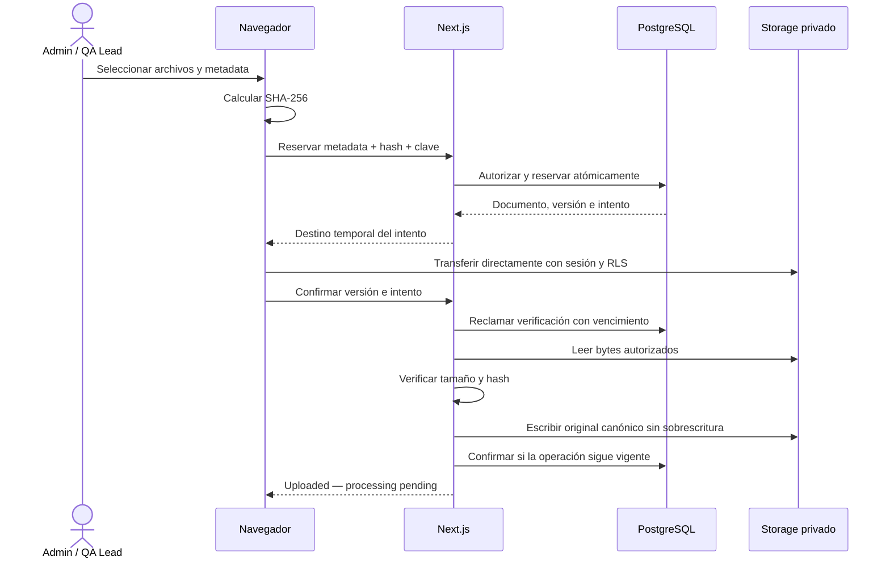

# S1-02 — Aislamiento, autorización y cierre de integración

Fecha: 2026-10-02. Base revisada: `661eaf416d67ea4c0b97fe08f13c08abe78011d1`.

Estado: spec escrita aprobada por el usuario el 2026-10-02, condicionada a resolver los hallazgos incluidos y cumplir S1-02. No constituye implementación, migración ejecutada ni evidencia de cierre. Implementación detallada en el [plan S1-02](../plans/2026-10-02-s1-02-tenant-isolation-integration.md).

## 1. Propósito y fuentes

Entregar S1-02 sobre las implementaciones integradas de Auth/Workspace, ingesta y Repository. Admin y QA Lead deben cargar, recuperar y abrir originales de su workspace; Member no puede descubrir ni modificar documentos. La protección debe funcionar aunque se evite la UI. Se incluyen los hallazgos de integración identificados y una UI mínima de carga, por ampliación explícita del usuario.

Fuentes normativas:

- [Ticket S1-02 y tickets relacionados](../../Tickets/tickets.md).
- [PRD](../../PRD/knowledge-decay-monitor-prd-final.md), roles, privacidad y alcance por sprint.
- [Arquitectura base](../../architecture/arquitectura-base.md), [ADR-001](../../architecture/adr/ADR-001-monolito-modular.md) y [Día Cero](../../architecture/day-zero-protocol.md).
- [Spec S1-01](2026-09-27-s1-01-auth-workspace-design.md) y [spec S1-03 integrada](2026-09-27-s1-03-ingestion-spec.md).
- [Informe de hallazgos y atribución Git](../../reviews/2026-10-02-s1-02-integration-findings.md).

Las decisiones de este documento cambian explícitamente partes del contrato S1-03: finalización con verificación de bytes, estados de carga, idempotencia y recuperación. Se preservan la carga directa a Storage, el bucket privado, el límite de 10 MiB y la ruta canónica del original. Al implementar se actualizarán contratos y documentación compartida; no se reinterpretarán silenciosamente los documentos anteriores.

## 2. Alcance y límites

Incluye identidad común, RBAC, RLS/GRANT/RPC/Storage, adaptación de ambos consumidores, UI mínima, SHA-256, recuperación sin duplicados, reconciliación de datos anteriores, migraciones local/nube, observabilidad segura, pruebas y controles de integración/despliegue. Dev 1 coordina el conjunto y los cambios compartidos; ingesta conserva sus responsabilidades de negocio y Repository sus proyecciones y presentación.

No incluye parsing, OCR, chunking, embeddings, worker de procesamiento, análisis IA, créditos, invitaciones, administración de roles, asignaciones de Member, aprobación de v2+, eliminación de documentos confirmados ni Retry Processing. S1-04 y S1-07 conservan esas responsabilidades. Confirmar una carga no significa que el documento sea parseable o analizable.

El alcance es una entrega coordinada con cinco capacidades: autorización; reserva y transferencia; verificación/recuperación; Repository; migración y controles. El plan podrá dividirlas en cambios pequeños, pero no declarar el ticket cerrado dejando un hallazgo incluido sin resolver.

## 3. Base comprobada y límites de la evidencia

En la revisión de esta conversación, a 2026-10-02:

| Superficie | Evidencia |
|---|---|
| Git | Auth S1-01 más ingesta y Repository integrados; HEAD `661eaf4` |
| Supabase local y proyecto nube vinculado | CLI: solo `00001` aplicada; `20260930182112` pendiente; consultas de catálogo: no existe `size_bytes` ni `reserve_document` |
| Base/Storage en ambos entornos | RLS activa en las cinco tablas; bucket `documents` privado, límite 10 485 760 bytes y MIME esperados |
| Aplicación local | Destino de `.env.local`: Supabase local; no se publicaron valores |
| Vercel | Preview de `develop` en `661eaf4`, estado `READY`; no acredita upload operativo |
| Variables de Vercel | Nombres necesarios de Auth presentes en producción y preview de `develop`; valores no descifrados; otras ramas no quedan cubiertas por esa configuración específica |
| Pruebas | 142 unitarias Auth/ingesta y 9 de Repository aprobadas por separado; `tsc --noEmit` aprobado; lint sin errores y tres warnings; `git diff --check` aprobado |

No se ejecutaron migraciones, build ni E2E de esta integración. No se verificaron protecciones remotas de GitHub ni entrega real de eventos a Sentry. Los resultados anteriores son una fotografía, no controles de la implementación futura. Antes de ejecutar el plan se volverán a comprobar destinos, HEAD y migraciones.

## 4. Identidad y permisos

### 4.1 Matriz de S1

| Operación dentro del workspace propio | Admin | QA Lead | Member |
|---|---|---|---|
| Shell y contexto propio | Sí | Sí | Sí |
| Listar documentos, versiones y chunks | Sí | Sí | No |
| Abrir original confirmado | Sí | Sí | No |
| Reservar, cargar, confirmar y recuperar upload | Sí | Sí | No |
| Consultar miembros elegibles como Owner | Sí | Sí | No; solo Profile propio |
| Renombrar workspace, mediante permiso existente | Sí | No | No |
| Cambiar roles/tenant directamente | No | No | No |
| Escribir chunks o estados de procesamiento directamente | No | No | No |
| Borrar originales confirmados desde este flujo | No | No | No |
| Recursos de otro workspace | No | No | No |

No se añade pantalla de renombrado; se prueba la restricción ya existente. Owner es metadata, no asignación ni permiso. Las asignaciones de Member y los findings aún no existen en S1: no se crean tablas futuras para simular su cobertura.

### 4.2 Contrato común

`identity` conserva una única implementación de `requireActor()`, con identidad verificada y Profile persistido. Tenant, rol y usuario enviados por navegador nunca autorizan. Repository deja de usar su implementación paralela y deja de importar internos de `identity`.

La autorización compartida usa funciones pequeñas con una matriz cerrada de operaciones de S1. No incorpora un motor genérico de políticas ni permisos configurables. Las acciones resuelven el Actor dentro del servidor; una función interna que reciba Actor no es un punto de entrada público. Las lecturas normales usan cliente de sesión y RLS.

| Condición | Resultado de acción |
|---|---|
| Sin sesión válida | `UNAUTHENTICATED` |
| Sesión verificada sin workspace, o rol no permitido | `FORBIDDEN` |
| Recurso inexistente o fuera del tenant, tras autorizar la capacidad | `NOT_FOUND`, mismo mensaje |
| Input inválido | `INVALID_INPUT` |
| Clave reutilizada con otro contenido, intento obsoleto o estado incompatible | `CONFLICT` |
| Proveedor/consulta indisponible | `INTERNAL_ERROR`, sin asumir ausencia ni permitir continuar |

Los errores de identidad se interpretan por código tipado, no comparando mensajes. Un fallo al consultar Auth no se confunde automáticamente con logout. Las rutas pueden redirigir a login/onboarding; las acciones conservan `ActionResult<T>`. La ausencia de permiso de Member no depende del layout.

### 4.3 Operaciones privilegiadas

Promoción del original, eliminación de objetos rechazados y transiciones verificadas necesitan un cliente técnico exclusivo de servidor. Se usará `SUPABASE_SERVICE_ROLE_KEY`, sin prefijo público, sin compartir cookies/sesión del usuario y sin reexportarlo desde un barrel de cliente. La ausencia de la clave bloquea esas operaciones con error controlado; nunca activa un fallback permisivo.

Antes de cada operación se resuelven usuario, rol, tenant, versión, ruta e intento desde datos persistidos. Las RPC privilegiadas tienen ejecución revocada a `PUBLIC`, `anon` y `authenticated`, y acceso explícito del rol servidor. El `userId` interno proviene exclusivamente de la identidad verificada; la RPC vuelve a contrastar Profile y pertenencia. No acepta un Actor del request. La sesión de servicio evita RLS: las consultas requieren predicados y FKs de tenant explícitos.

## 5. Arquitectura de carga y alternativas

Se compararon: mantener solo reserva/metadata; enviar el archivo completo a Next.js; conservar carga directa y verificar desde servidor. Se elige la tercera: satisface 10 MiB, recuperación e integridad sin usar el payload de Vercel para transportar el archivo del navegador.

Las peticiones navegador → Next.js contienen metadata, IDs y hashes; las respuestas no contienen archivos. La lectura servidor → Storage y la publicación del original consumen transferencia y tiempo. Se procesará un archivo por llamada de verificación, máximo dos transferencias directas simultáneas por UI y una verificación por UI. El límite por lote sigue siendo diez; no se acumulan 100 MiB en una función.

El lector de servidor cuenta los bytes recibidos y aborta al superar 10 485 760, aunque Content-Length o metadata declaren menos. No sigue una URL de descarga proporcionada por el navegador: deriva bucket/ruta del registro autorizado. Los bytes comprobados se mantienen solo durante la operación; no se escriben en logs ni artefactos. La aplicación no promete un límite global de concurrencia por tenant en esta entrega; las reclamaciones por versión impiden duplicar una verificación del mismo original.

El límite publicado de Vercel es 4,5 MB para el cuerpo de petición/respuesta de la función. Interpretamos que una lectura saliente a Storage no es ese payload, pero la compatibilidad completa debe demostrarse con 10 MiB en Vercel antes del cierre. Un problema en esa prueba bloquea aceptación; no autoriza retirar la verificación ni declarar éxito local como éxito remoto.

## 6. Reserva, archivos e idempotencia

Se admiten 1–10 archivos, 1–10 485 760 bytes por archivo, PDF, DOCX y Markdown. Cada uno requiere nombre de documento de 1–200 caracteres tras trim, categoría del enum y Owner válido del workspace. La extensión determina MIME canónico. No se exige que un Markdown tenga ocho bytes: cualquier control de prefijo debe aceptar archivos pequeños válidos y no presentarse como validación completa del formato.

El navegador calcula SHA-256 sobre todos los bytes; servidor/RPC valida 64 caracteres hexadecimales normalizados. Tamaño, extensión y hash esperado se fijan en la reserva. La verificación compara los bytes reales, no vuelve a confiar en el hash declarado. El hash no prueba inocuidad, autoría ni formato; eso no convierte un archivo en `ready`.

Cada archivo lleva una clave UUID generada antes de reservar. La base impone unicidad por workspace, iniciador y clave. En una sola transacción crea documento, v1, referencia idempotente e intento. Mismo contenido normalizado y misma clave devuelven los mismos IDs; otra metadata/tamaño/hash devuelve `CONFLICT`. La huella de la solicitud permite reconocer el reintento aunque después cambie el nombre visible. No hay deduplicación automática por hash: dos cargas intencionales con claves distintas pueden crear dos documentos.

Los IDs se generan en servidor. El navegador conserva solo referencias opacas de las operaciones pendientes, separadas por usuario y entorno, sin archivos, nombres, hashes ni tokens en almacenamiento persistente. Tras una respuesta perdida reintenta con la misma clave o consulta sus reservas; no crea una nueva por defecto. Otro Admin/QA recupera por versión, sin suplantar la clave del iniciador.

## 7. Estados persistidos y concurrencia

### 7.1 Datos mínimos

`document_versions` conserva `size_bytes` y `storage_path` canónico. Se amplía con estado de carga, hash esperado, procedencia de la referencia (`client_declared` o `legacy_reconciled`), fecha de confirmación, iniciador/clave/huella de reserva, intento actual e identificador/vencimiento de operación. Los nombres SQL definitivos seguirán estas responsabilidades en el plan; los tipos de estados y restricciones descritos aquí son contractuales.

Una tabla de intentos registra ID, workspace, versión, ruta temporal inmutable, intento vigente/retirado y limpieza pendiente/comprobada. Tiene RLS, GRANT mínimos, FKs compuestas y un índice por versión. Una nueva migración añade índices para idempotencia y consultas por workspace/estado. No se edita a mano `database.ts`.

Los usuarios no escriben directamente hashes, estados, confirmaciones, leases ni intentos. Se retira el acceso directo de inserción de documentos/versiones y la RPC antigua al activar el flujo nuevo; la reserva autorizada del servidor sustituye esas entradas. Esto evita saltarse idempotencia y crear nuevas versiones con hash/tamaño omitidos. Las pruebas existentes se actualizan para exigir la nueva frontera, sin perder las negativas cross-tenant.

### 7.2 Máquina de estados

| Estado | Condición | Transiciones |
|---|---|---|
| `pending` | Reserva o intento pendiente de confirmar | `verifying` |
| `verifying` | Operación de comprobación reclamada | `confirmed`, `rejected`, `pending` por ausencia comprobada/fallo temporal recuperable |
| `confirmed` | Original canónico coincide con la referencia | Terminal para upload; S1-04 podrá procesar |
| `rejected` | Tamaño/hash comprobados no coinciden | `recovering` |
| `recovering` | Retiro y limpieza del objeto inválido | `pending` tras recuperación comprobada; permanece recuperable ante fallo |

Un registro anterior todavía no reconciliado tiene estado de carga NULL y se presenta como `Needs reconciliation`; NULL no es un sexto estado de cargas nuevas. Ni NULL ni `pending` autorizan abrir un original.

Todas las transiciones usan compare-and-set dentro de una transacción breve. La lectura de Storage ocurre fuera de la transacción SQL. La verificación tiene presupuesto máximo de 60 segundos y lease de 120 segundos; una operación que exceda su presupuesto aborta, y una vencida requiere reclamar un nuevo ID. Estos límites se prueban contra el runtime desplegado; una ampliación exige revisar conjuntamente timeout y lease.

Finalizar exige que ID de operación, intento, estado y lease sigan vigentes. Un resultado tardío no modifica la base. Después de una interrupción se reconcilia la existencia del original antes de repetir. Confirmar `confirmed` devuelve el mismo resultado sin descargar de nuevo. La renovación de operación no cambia el hash esperado.

### 7.3 Aislar transferencias en vuelo — precisión técnica para revisión

Reutilizar siempre la misma ruta para archivos rechazados permite carreras: una transferencia antigua puede terminar después de que venza un bloqueo. Un lease SQL por sí solo no revoca una petición a Storage ya iniciada.

La solución concreta propuesta mantiene el original final en la ruta acordada:

`documents/<workspace_id>/<document_id>/<version_id>/original.<ext>`

Aquí `documents` es el bucket. Cada transferencia del navegador usa, dentro del mismo bucket privado:

`<workspace_id>/<document_id>/<version_id>/attempts/<attempt_id>/original.<ext>`

Estas rutas temporales son una ampliación explícita del contrato de Storage, no nuevas rutas de originales. Solo existe un intento vigente por versión. El navegador puede INSERT únicamente en la ruta registrada de ese intento cuando la versión permite transferencia. No obtiene lectura general, UPDATE, DELETE ni signed URL para objetos temporales. La ruta final nunca admite escritura directa de usuario.

La política mínima es INSERT sin upsert. Si la versión desplegada de Storage requiere SELECT para devolver metadata de la inserción, ese permiso se limita a la operación de upload mediante los helpers de operación, conservando denegadas descarga, listado y firma de temporales. Se comprueban las operaciones reales y disponibilidad de los helpers en local/nube antes de activar esa política; no se soluciona un 403 permitiendo lectura global. La documentación de acceso describe INSERT como suficiente, mientras la de troubleshooting advierte sobre INSERT RETURNING: la prueba del runtime es obligatoria para resolver esa diferencia.

Una vez comprobado tamaño/hash, el servidor publica exactamente los bytes comprobados en el original final con creación sin sobrescritura. No verifica un objeto para luego volver a leer otro contenido sin comprobarlo. Si el original ya existe, valida el existente; una colisión nunca se trata como éxito sin comprobar hash/tamaño. `confirmed` solo se persiste después de demostrar que el original final coincide.

Una publicación antigua de bytes ya verificados puede terminar después del lease. Como el hash esperado es inmutable y la ruta final nunca se sobrescribe, solo puede dejar el mismo original válido para reconciliación posterior; no autoriza por sí misma `confirmed`. Las recuperaciones ordinarias eliminan únicamente rutas temporales retiradas, jamás la ruta final. Esta separación protege al original confirmado de un borrado tardío.

Si una carga previa termina tarde en su ruta retirada, no afecta el intento actual ni concede lectura. La limpieza debe volver a inspeccionar intentos retirados incluso si antes observó ausencia; no se confunde esa observación con una garantía de que no llegará un request antiguo. Se entrega un comando operativo idempotente de inspección/limpieza de intentos retirados, limitado a esas rutas y sin contenido en salida. Se ejecuta después de pruebas de interrupción y antes de cierre; no se delega al Purge Worker de Sprint 5. No se introduce aquí un worker de procesamiento.

### 7.4 Recuperación y fallos

Admin o QA Lead del mismo workspace puede recuperar, aunque no iniciara la carga ni sea Owner. Recuperar conserva documento, versión, metadata, hash y ruta final. No es Replace File ni Retry Processing.

Se reconcilia primero el original final: si coincide, se completa confirmación; si difiere, se bloquea como inconsistencia y no se sobrescribe ni elimina automáticamente. Para un intento temporal rechazado, el servidor reclama recuperación, retira el intento, elimina exclusivamente su objeto y comprueba el resultado. Después habilita un nuevo intento/ruta. Fallos de red mantienen recuperación pendiente; no abren un intento nuevo suponiendo que se borró.

Errores transitorios no significan hash incorrecto. La UI consulta estado antes de repetir. Una verificación vencida permite reintentar la verificación; una recuperación vencida repite limpieza de la ruta retirada, con nuevo identificador de operación. La limpieza no toca otra generación ni originales finales.

`processing_status` de una nueva v1 permanece `uploaded`, `version_status` NULL y `active_version_id` NULL. S1-02 no falsifica `processing_failed` para una transferencia fallida ni activa la v1. S1-04 deberá exigir carga confirmada antes de procesar.

## 8. Contratos y límites de módulos

| Entrada pública objetivo | Responsabilidad |
|---|---|
| `identity.requireActor()` y guardas de operación | Contexto verificado, roles y errores comunes |
| `workspace.listEligibleOwners()` | IDs/nombres de miembros válidos del tenant para Admin/QA; no emails |
| `ingestion.reserveUpload(items)` | Añade clave idempotente y hash a cada item; resultado parcial por archivo, IDs e intento/destino autorizado |
| `ingestion.getUploadState(versionId)` | Estado persistido y acción posible; no convierte una consulta en borrado |
| `ingestion.finalizeUpload({ versionId, attemptId })` | Un archivo por llamada, validado también en servidor; devuelve `ActionResult` con confirmación/estado o error controlado; rechaza intentos obsoletos |
| `ingestion.resumeUpload(versionId)` | Reautoriza y devuelve el intento utilizable; reconcilia antes de indicar transferencia |
| `ingestion.recoverUpload(versionId)` | Recuperación explícita y controlada; acepta identificadores, nunca bucket/path arbitrarios |
| `repository.listDocuments(query)` | Proyección con última versión, estados de carga/procesamiento y capacidades de UI |
| `repository.getOriginalUrl(versionId)` | Sesión/RLS, carga confirmada, ruta canónica, URL de 300 segundos |

Todas devuelven `ActionResult<T>` o resultados por item dentro de ese sobre. Un lote procesado con todos sus items fallidos no muestra éxito global en UI. La finalización cambia explícitamente de array de versiones a una versión/intento por llamada para acotar recursos y detectar solicitudes antiguas; la UI agrega los resultados por archivo. Confirmar una versión ya confirmada devuelve su resultado sin mutar aunque el intento recibido sea antiguo, después de autorizar el recurso. Las modificaciones de DTO se actualizan junto a todos sus consumidores. `retryProcessing` continúa reservado a S1-07.

Repository solicita escrituras a ingesta y no modifica estados. Se añaden exports públicos donde falten; los componentes cliente importan DTO/componentes seguros o acciones explícitas, no un barrel que mezcle cliente privilegiado con schemas de navegador. No se añaden capas de forwarding ni HTTP interno.

## 9. Repository y experiencia de usuario

La UI es inglesa, responsive y desktop-first. En Repository, Admin/QA ve `Upload documents`, tabla de archivos, metadata por archivo y validación. Se sugieren el nombre del archivo sin extensión y el usuario actual como Owner, ambos editables antes de reservar. Categoría exige selección. Las opciones de Owner provienen del servidor del tenant.

Se diferencian `Preparing`, `Uploading`, `Verifying`, `Upload incomplete`, `Upload rejected`, `Recovering`, `Uploaded — processing pending` y `Needs reconciliation`. No se inventan porcentajes: se muestra progreso real si el transporte lo proporciona o un indicador indeterminado. Las filas confirmadas quedan visibles cuando otra falla.

`Resume upload` permite volver a seleccionar el archivo y comparar su hash con la reserva. Si ya llegó, verifica sin transferirlo otra vez; si falta, retransfiere el archivo completo. No se implementa reanudación por offset. `Retry upload` explica la retirada del objeto temporal rechazado. No altera metadata ni hash. Las acciones incompatibles quedan bloqueadas en UI y servidor.

Original confirmado habilita `Open original`, incluso antes del parsing; los estados no confirmados no lo habilitan. Si el navegador bloquea la pestaña se presenta un error controlado, sin afirmar que se abrió. No se añade renderizado HTML/Markdown privado en la aplicación.

La búsqueda existente se valida con Zod en la frontera: nombre hasta 200 caracteres, categoría/estado del enum, Owner UUID o NULL, página entera positiva, tamaño de página 1–100; defaults 1/25. Los campos desconocidos de autorización se rechazan. NULL mantiene significado distinto de omitido. Nombre usa coincidencia literal parcial, sin permitir que comodines cambien su significado.

La última versión se determina antes de evaluar su filtro de estado; no se muestra una versión antigua solo porque cumple el filtro. El listado incluye reservas sin versión activa y distingue empty state de error. Se añade orden estable por fecha e ID. Estas correcciones preservan las capacidades ya integradas; no incluyen un nuevo buscador semántico ni amplían el panel de filtros de S1-06.

## 10. RLS, GRANT y API directa

Todas las tablas nuevas de negocio tienen RLS y permisos explícitos. Las FKs compuestas impiden mezclar workspace, documento, versión e intento incluso en operaciones privilegiadas. No se permite mover tenant, escalar rol, cambiar hash o marcar carga/procesamiento por REST directo.

Admin/QA leen metadata de su tenant; Member solo su contexto/Profile y workspace. Storage permite lectura de originales canónicos confirmados y excluye temporales y legacy sin reconciliar. Las mismas reglas se comprueban en la API directa de firma/descarga/listado, no solo en la acción de aplicación. La aplicación fija 300 segundos; el usuario no controla bucket, path ni duración de esa acción.

Se revisan helpers `SECURITY DEFINER` existentes, `search_path`, EXECUTE y políticas del bucket. No se elimina RLS para resolver un problema de permisos. Las escrituras privilegiadas se acompañan de pruebas negativas de contexto falsificado. Los cambios de rol o eliminación de Profile se reflejan en la siguiente autorización; las URLs ya firmadas conservan su naturaleza de bearer temporal hasta expirar y no prometen revocación instantánea.

## 11. Observabilidad y privacidad

Se conserva el filtrado estricto de S1-01 y se generaliza la lista de eventos seguros para reserva, verificación, recuperación, reconciliación y Repository. Se reconstruye cada evento con campos permitidos: operación, código controlado, correlación e IDs técnicos necesarios; sin objetos de error crudos de Supabase.

No se registran documentos, chunks, bytes, nombres de archivo, búsquedas, hashes, rutas de Storage, URLs firmadas, cookies, tokens, claves, correos ni request/response bodies. Los rechazos esperados de permisos/input no se reportan como excepciones. Un fallo de telemetría no cambia el resultado de negocio.

Pruebas de captura incluyen el filtro real, no solo un mock de `captureException`. La aceptación remota genera un evento sintético permitido y comprueba recepción; no simula fallos exponiendo contenido real. Se mantiene separada la configuración de source maps de la de eventos runtime.

Playwright no guarda traces, videos, screenshots ni HAR de recorridos Auth/Storage que contengan datos sensibles. Un fallo de aserción no imprimirá signed URLs. Los artefactos solo contienen identificadores de escenario, estados, códigos y resultados sanitizados.

## 12. Migraciones y registros anteriores

### 12.1 Secuencia

Se conserva `20260930182112_reserve_document.sql` ya integrada. Las nuevas migraciones se crean con CLI y orden coordinado, sin reescribir `00001` ni la de Dev 2. Se prueban instalación limpia y upgrade real desde la base actual. Los tipos se regeneran desde el esquema local migrado.

La activación se hace por fases: expansión compatible de esquema; despliegue preparado con nuevas escrituras deshabilitadas; pausa de uploads antiguos y revocación de sus entradas; reconciliación; activación del flujo nuevo con las políticas definitivas. Durante la pausa, las acciones devuelven un estado controlado; no hay intervalo donde el código antiguo pueda confirmar saltándose el hash. Se documentan los instantes de corte y versiones de app/esquema compatibles.

Se permitirá pausar las cargas para desplegar coherentemente. Un rollback deshabilita el flujo nuevo y preserva datos; no borra columnas ni reactiva políticas antiguas que saltan controles. Las URLs antiguas emitidas antes del corte no pueden declararse revocadas por cambiar RLS.

### 12.2 Reconciliación

Un comando de servidor tendrá modo inspección y modo aplicación idempotente, con destino explícito y métricas sanitizadas. No se descargarán originales a archivos locales ni se exportarán hashes. Estado NULL impide apertura mientras se resuelve el registro.

| Caso anterior | Decisión |
|---|---|
| No hay original y no completó procesamiento | Mostrar carga incompleta; permitir fijar una referencia una sola vez al seleccionar archivo, conservar metadata/doc/v1 |
| Original existe y no hay hash previo | Leer con límite, verificar tamaño y fijar hash como `legacy_reconciled`; no afirmar coincidencia con la selección histórica |
| Ya estaba `ready`/activa y original válido existe | Preservar estados/puntero y confirmar únicamente integridad de carga reconciliada |
| Ya procesada pero original falta o es inconsistente | No habilitar recarga ordinaria ni modificar chunks/puntero; registrar incidencia y mantener apertura bloqueada hasta resolución explícita |
| Error de red/permisos al inspeccionar | Mantener pendiente; no inferir ausencia |
| Original histórico inválido en ruta canónica, nunca confirmado/procesado | Recuperación de legado bajo la pausa de escrituras antiguas, antes de habilitar promoción nueva; limpieza específica del registro, nunca un barrido por prefijo |

La limpieza excepcional de originales legacy es exclusiva del corte controlado. Una vez activo el flujo nuevo, la recuperación ordinaria no elimina canónicos. El inventario debe comprobar que no quedan cargas antiguas en vuelo antes de esa limpieza; si no puede comprobarse, ese registro no se habilita para promoción y bloquea su reconciliación.

Tras el corte, nuevas reservas no admiten estado/hash NULL. Las reservas históricas sin referencia que se recuperen registran cuándo y por quién se fijó por primera vez. No se inventan hashes para el seed ni se considera válido un vector sintético como evidencia de procesamiento real.

### 12.3 Servicios

| Servicio | Preparación y aceptación |
|---|---|
| Supabase local | Migraciones, fixtures descartables, RLS/RPC/Storage por HTTP y pruebas de interrupción |
| Supabase nube | Inventario, respaldo/recuperación documentada, migraciones versionadas, reconciliación, políticas y originales sintéticos; jamás reset ni seed local |
| Vercel | Mismo proyecto de datos esperado; variables por entorno de aceptación; secreto servidor para operaciones privilegiadas; runtime Node y duración compatible; prueba 10 MiB; limitar previews sin configuración |
| Sentry | Source maps según configuración existente y recepción de evento seguro de los módulos nuevos |
| GitHub | Suites completas, nombres de checks estables, protección efectiva de integración y bloqueo de promoción a entorno aceptado si fallan |
| Auth/email | No cambia el mecanismo; regresión S1-01. Plantilla, callbacks y SMTP alojados no quedan probados por Mailpit local |

No hacen falta nuevos proveedores ni desplegar un worker de embeddings en este ticket. Sí se amplían permisos, datos y operaciones servidor de los servicios existentes. El secreto privilegiado debe existir en cada entorno donde se habilite upload; su presencia en producción no demuestra que exista en preview.

## 13. Verificación y aceptación

### 13.1 Matriz obligatoria

| ID | Escenario | Prueba principal |
|---|---|---|
| A01 | Admin/QA positivos y Member negativo, incluso Owner | Unitarias + SQL + HTTP + navegador |
| A02 | Leer/insertar/actualizar/eliminar cross-tenant A→B y B→A, incluyendo intentos | SQL/REST; cero filas afectadas también cuenta como denegación comprobada |
| A03 | QA no renombra; nadie escala rol/mueve tenant/forja estados | SQL y operaciones directas |
| A04 | Sesión vencida, sin Profile, fallo de Auth/DB | Integración y mensajes controlados |
| A05 | Carga real y apertura del original confirmado | Navegador + respuesta real de Storage, no solo URL con token |
| A06 | 1 y 10 archivos, 11 rechazados, 10 MiB aceptado y 10 MiB + 1 rechazado | UI/servidor/Storage y despliegue Vercel |
| A07 | Metadata inválida, Owner ajeno, MIME/prefijo incoherente, Markdown pequeño | Validación y SQL |
| A08 | Respuesta de reserva perdida y doble envío concurrente | Mismos IDs; clave con otro contenido devuelve conflicto |
| A09 | Carga completa con respuesta perdida, recarga y otra sesión Admin/QA | Reconcilia sin duplicar ni sobrescribir |
| A10 | Hash/tamaño incorrectos y error transitorio | Rechazo solo por discrepancia comprobada; no falso `confirmed` |
| A11 | Recuperación, doble confirmación, lease vencido, verificador y DELETE tardíos | Concurrencia real e interrupciones; canónico confirmado intacto |
| A12 | Transferencia antigua termina después de iniciar otro intento | Solo ruta retirada afectada; aislamiento y limpieza repetida comprobados |
| A13 | Firma/descarga directa sobre temporales, incompletos y otro tenant | Denegación backend y RLS; no filtrar metadata |
| A14 | Filtros combinados, NULL, última versión, paginación y conteos | Integración con ambos tenants, sin sustituir por mocks |
| A15 | Upgrade y base vacía, legacy con/sin objeto y procesada | Migraciones reproducibles, punteros/estados preservados |
| A16 | Evento seguro y descarte de contenido sensible | Filtro real + evento sintético recibido en Sentry |
| A17 | CI ejecuta todas las suites y bloquea integración/promoción al fallar | Workflow y configuración remota comprobados |
| A18 | Regresión registro, bootstrap, login, recuperación y logout | Suites S1-01 |

Los escenarios destructivos y de carreras se ejecutan con fixtures locales descartables. En nube se usan cuentas autorizadas y archivos sintéticos, con limpieza de esas pruebas delimitada. No se usan documentos reales para provocar fallos.

### 13.2 Comandos y controles

Se conserva pnpm 12.5.1 y lockfile. `test:unit` incluirá las pruebas de `tests/unit` y las de Repository, mediante una configuración inequívoca. `test` no seleccionará silenciosamente otra suite. CI ejecutará lint, typecheck con generación Next.js, unitarias, SQL RLS, fixtures, integración, build y E2E críticos. Chromium será el navegador obligatorio; Edge se mantiene opcional con instalación explícita fuera del gate mínimo.

No se reutiliza un servidor local de entorno desconocido para aceptación. El runner fuerza destino local y Sentry deshabilitado durante pruebas locales. Los E2E fallan si falta un fixture esperado: no contienen condiciones que omitan la apertura o la comprobación de estados.

### 13.3 Definición de terminado

El ticket exige: matriz anterior aprobada; permisos sin bypass por API directa; recuperación sin pérdida ni duplicados; migraciones aplicadas y reconciliación resuelta en los entornos acordados; 10 MiB comprobados en Vercel; Sentry seguro operativo; checks remotos efectivos; documentación y contratos actualizados; informe de hallazgos enlazado a commits de corrección y evidencia.

No basta un build verde, unitarias con mocks, RLS activada o un deployment `READY`. Un bloqueo externo se registra como pendiente y no se presenta como ticket terminado. Parsing/embeddings/worker permanecen fuera y no impiden el cierre de esta carga confirmada; cualquier prueba futura que los necesite se atribuye a S1-04.

## 14. Decisiones técnicas concretadas al escribir

Para cumplir las garantías aprobadas, esta spec propone de forma explícita: rutas temporales por intento en el mismo bucket y promoción a ruta canónica; revocar inserciones/RPC antiguas que eviten el contrato; cliente privilegiado de servidor; publicación sin sobrescritura; comando repetible de limpieza; presupuesto de 60 segundos/lease de 120; y tratamiento cerrado de originales legacy incoherentes. Estas precisiones forman parte de la revisión de la spec, no se atribuyen a una aprobación previa de APIs o tablas exactas.

La spec escrita quedó aprobada el 2026-10-02. El plan concreta archivos, migraciones, dependencias, pruebas y orden de despliegue. No se hace commit, push ni despliegue por el mero hecho de escribir estos documentos.

## 15. Actualización de implementación local — 2026-10-03

La recuperación desde otra sesión se concreta con una acción visible en las filas del Repository que aún no tienen carga confirmada. Admin/QA vuelven a seleccionar el original; el navegador calcula tamaño y SHA-256, y la aplicación los contrasta con los valores persistidos antes de devolver el target temporal. La RPC service-only `authorize_upload_resume_reference` aplica esa comprobación con Profile/rol/tenant de la base; un Member o una identidad de otro workspace no recibe una ruta. Las versiones legacy con `upload_state IS NULL` permanecen como “Needs reconciliation” y no muestran la CTA de recuperación normal, que no puede completar su protocolo en línea. La migración aditiva `20261003214934_s1_02_upload_resume_reference_guard.sql` contiene ese guard y sus grants; `src/types/database.ts` se regeneró desde Supabase local.

Este guard evita transferir bytes distintos durante una reanudación cross-session, sin enviar el archivo por Next.js ni cambiar el diseño directo a Storage que evita el límite de body de Vercel de 4.5 MB. La instalación limpia, upgrade, Storage local y suites están documentados en [el acta de aceptación](../../testing/s1-02-acceptance.md). Esta migración permanece sin aplicar a Supabase cloud junto con las demás fases de corte.

## 16. Referencias técnicas contrastadas

- [Vercel Functions: límites](https://vercel.com/docs/functions/limitations#request-body-size): distinción entre payload de invocación y trabajo interno; prueba remota exigida en §5.
- [Supabase Storage: control de acceso](https://supabase.com/docs/guides/storage/security/access-control): políticas y separación de privilegios.
- [Helpers de Storage](https://supabase.com/docs/guides/storage/schema/helper-functions): permisos limitados por operación cuando el runtime los requiera; comprobar también el rechazo de firma/descarga.
- [Supabase Storage: cargas estándar](https://supabase.com/docs/guides/storage/uploads/standard-uploads): comportamiento de creación y sobrescritura; la estrategia de intentos de esta spec es diseño del proyecto, no garantía ofrecida por Storage.
- [Supabase: RLS](https://supabase.com/docs/guides/database/postgres/row-level-security).
- SDK instalado `@supabase/storage-js@2.117.2`, `src/lib/types.ts`: `FileObject.metadata.size`, contrastado con Context7 durante la revisión.

Las APIs concretas, firmas y opciones de runtime se volverán a contrastar al escribir el plan. Los documentos de Next.js instalados se consultarán antes de modificar su código o configuración.
