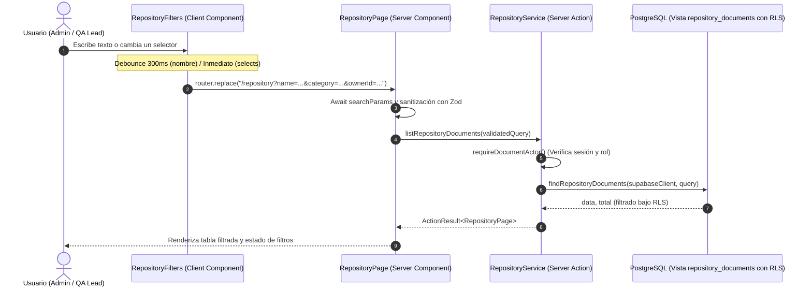

# S1-06 — Búsqueda y Filtros Básicos del Repository — Especificación de Diseño

- **Fecha:** 2026-10-04
- **Ticket:** S1-06 (Búsqueda y filtrado de documentos)
- **Estado:** Propuesta de Diseño
- **Autor:** Antigravity (Pair Programming con el usuario)

---

## 1. Contexto y Objetivos

### 1.1 Contexto
El sistema **Knowledge Decay Monitor** es un SaaS B2B para detectar contradicciones y obsolescencia en documentación privada. En el Sprint 1 se implementa el repositorio documental privado base. El ticket S1-06 extiende la vista del Repository para que los usuarios autorizados (`Admin` y `QA Lead`) puedan buscar documentos por nombre y filtrarlos por categoría, propietario (Owner) y estado funcional de versión, manteniendo el aislamiento estricto multi-tenant y las reglas de autorización RBAC.

### 1.2 Objetivo
Proporcionar una experiencia de búsqueda y filtrado fluida, responsiva y sincronizada en tiempo real mediante parámetros de URL (`searchParams`), asegurando que las consultas se validen mediante Zod y se ejecuten en base de datos bajo Row Level Security (RLS).

### 1.3 Criterios de Aceptación (DoD)
1. `Admin` y `QA Lead` pueden buscar documentos por nombre.
2. Se puede filtrar por:
   - **Category:** SOP, Policy, Manual, QA Process, Security, Engineering Guideline, Other.
   - **Owner:** Usuarios válidos del mismo Workspace y opción para `Unassigned` (`null`).
   - **Version State:** Estados funcionales (`active`, `historical`, `pending_approval`, `rejected`) y opción para versiones iniciales en proceso (`null`).
3. La búsqueda por nombre y los filtros pueden combinarse libremente.
4. Los resultados y conteos siempre pertenecen al Workspace autenticado; ninguna búsqueda expone metadatos o nombres de otros tenants.
5. Las opciones del filtro de Owner solo listan miembros elegibles del mismo Workspace.
6. Todos los parámetros se validan mediante Zod (`repositoryQuerySchema`).
7. Una búsqueda sin coincidencias presenta un estado vacío contextual (*Empty State*) claro con acción de reinicio, nunca un error de sistema.
8. El rol `Member` tiene denegado el acceso al Repositorio y no puede utilizar endpoints ni parámetros para descubrir documentos globales.
9. La sincronización es fluida con *debounce* en el texto de búsqueda y actualización inmediata en los selectores.

---

## 2. Arquitectura del Sistema y Flujo de Datos

### 2.1 Flujo de Información (URL-Driven State)

### 2.2 Componentes Involucrados

1. **`src/app/(workspace)/repository/page.tsx` (Server Component):**
   - Declara `export const runtime = "nodejs"`.
   - Recibe la prop `searchParams: Promise<{ [key: string]: string | string[] | undefined }>`.
   - Utiliza una función auxiliar de sanitización (`parseRepositorySearchParams`) que mapea strings crudos a `RepositoryQuery` y los valida contra `repositoryQuerySchema`.
   - Realiza la llamada concurrente a `listRepositoryDocuments(query)` y `listEligibleOwners()`.
   - Pasa los filtros activos, la lista de propietarios elegibles y el estado de resultados al componente `<RepositoryFilters />` y a la tabla.

2. **`src/modules/repository/ui/repository-filters.tsx` (Client Component):**
   - Marcado con `"use client"`.
   - Usa los hooks de Next.js: `useRouter()`, `usePathname()`, `useSearchParams()`.
   - Renderiza:
     - Input de búsqueda por nombre con icono de lupa y botón para limpiar texto.
     - Select de Categorías (opciones del MVP).
     - Select de Propietarios (opciones: "All owners", "Unassigned", más perfiles del workspace).
     - Select de Estado de versión (opciones: "All statuses", "Active", "Processing / Not active").
     - Botón "Clear filters" visible si hay filtros activos.
   - Maneja el cambio de nombre con un temporizador de *debounce* (300ms) dentro de `useTransition` para evitar bloqueo de UI.
   - Cada cambio de filtro reinicia `page` a `1` en los parámetros de la URL.

3. **`src/modules/repository/infrastructure/repository.repository.ts` (Existente):**
   - Utiliza `findRepositoryDocuments` que ya implementa:
     - Escape de comodines SQL vía `escapeLikeLiteral()`.
     - Filtros condicionales con `.ilike("name", ...)`.
     - Filtro `.eq("category", ...)`.
     - Filtro `.eq("owner_id", ...)` o `.is("owner_id", null)`.
     - Filtro `.eq("latest_version_status", ...)` o `.is("latest_version_status", null)`.
     - Paginación determinística con orden `created_at DESC, id DESC`.

---

## 3. Especificación de la Interfaz y Parámetros

### 3.1 Mapeo de Parámetros de URL a `RepositoryQuery`

| Parámetro URL | Tipo / Valores | Mapeo en `RepositoryQuery` | Descripción |
|---|---|---|---|
| `name` | `string` | `name?: string` | Subcadena de búsqueda recortada (`trim`). Se omite si está vacía. |
| `category` | Enum MVP | `category?: DocumentCategory` | Categoría documental exacta. |
| `ownerId` | `UUID` \| `"unassigned"` | `ownerId?: string \| null` | UUID del perfil. Si es `"unassigned"`, se mapea explícitamente a `null`. |
| `versionStatus` | `"active"` \| `"not_active"` | `versionStatus?: VersionStatus \| null` | Estado funcional. `"not_active"` se mapea explícitamente a `null`. |
| `page` | `number` (string) | `page?: number` | Entero $\ge 1$. Por defecto `1`. |
| `pageSize` | `number` (string) | `pageSize?: number` | Entero entre 1 y 100. Por defecto `25`. |

### 3.2 Manejo de Empty States
La tabla en `page.tsx` manejará dos variantes de estado vacío cuando `items.length === 0`:

1. **Estado Vacío del Workspace (Sin filtros activos):**
   - Mensaje: *"No documents in your workspace yet."*
   - Subtexto: *"Upload your first document above to get started."*
2. **Estado Vacío de Búsqueda (Con filtros activos):**
   - Icono informativo sutil.
   - Título: *"No documents found"*
   - Descripción: *"No documents match the selected filters."*
   - Botón de acción: *"Clear filters"*, que elimina todos los query params y recarga la vista base.

---

## 4. Requerimientos de Seguridad e Invariantes Multi-Tenant

1. **Frontera Primaria de Tenant:**
   - La resolución del Workspace se realiza exclusivamente en servidor leyendo la sesión activa con `requireDocumentActor()`. Nunca se acepta `workspace_id` proveniente de la URL o del cliente.
2. **PostgreSQL Row Level Security (RLS):**
   - La vista `public.repository_documents` tiene `security_invoker = true`.
   - Solo los roles `Admin` y `QA Lead` tienen concedida la política de lectura en `public.documents` para su propio `workspace_id`.
   - Consultas con manipulación de parámetros (ejemplo: buscar un término presente en Workspace B o pasar un `ownerId` de Workspace B) ejecutan la consulta dentro del contexto del Workspace autenticado, retornando `0` filas y jamás filtrando metadatos.
3. **Restricción de Rol `Member`:**
   - Un usuario con rol `Member` que navegue a `/repository` o invoque `listRepositoryDocuments` recibe `FORBIDDEN`. La UI muestra un mensaje de acceso denegado y no renderiza controles de búsqueda ni tablas.
4. **Protección contra Inyección:**
   - Sanitización de comodines en `name` mediante `escapeLikeLiteral` (`%` $\to$ `\%`, `_` $\to$ `\_`, `\` $\to$ `\\`).
   - Validación estricta con Zod en `repositoryQuerySchema`.

---

## 5. Estrategia de Pruebas

### 5.1 Pruebas Unitarias (`vitest run --config vitest.config.mts`)
- **`tests/unit/repository-search-params.test.ts`:**
  - Parsea correctamente query params vacíos a valores por defecto.
  - Parsea y normaliza `name`, `category`, `ownerId` y `versionStatus`.
  - Mapea `"unassigned"` a `null` y `"not_active"` a `null`.
  - Maneja de forma segura valores inválidos (categoría no soportada, páginas negativas) aplicando *fallback* seguro sin lanzar excepciones no controladas.
- **`tests/unit/repository-filters.test.ts`:**
  - Verifica que el componente de filtros renderice los campos con sus valores iniciales.
  - Verifica la presencia del botón "Clear filters" solo cuando existan filtros activos.
  - Verifica que el empty state contextual se muestre cuando no hay coincidencias.

### 5.2 Pruebas de Integración (`tests/integration/repository-search-filters.test.ts`)
- Ejecutadas sobre el stack local de Supabase:
  - Búsqueda por subcadena de nombre insensible a mayúsculas/minúsculas.
  - Filtrado por categoría específica.
  - Filtrado por propietario asignado y por `Unassigned`.
  - Filtrado por estado de versión activo vs. en proceso.
  - Filtrado multi-criterio combinado (nombre + categoría + owner).
  - Búsqueda sin coincidencias devuelve `{ data: [], total: 0 }` sin errores.
  - Aislamiento multi-tenant: Admin A buscando el nombre de un documento perteneciente a Workspace B no obtiene ningún resultado ni filtra información ajena.
  - Acceso denegado para el rol `Member`.

---

## 6. Plan de Implementación Resumido
1. Crear el módulo de utilidad de parseo y validación de `searchParams` (`src/modules/repository/utils/search-params.ts`).
2. Crear componente de UI `<RepositoryFilters />` (`src/modules/repository/ui/repository-filters.tsx`).
3. Actualizar `src/app/(workspace)/repository/page.tsx` para recibir `searchParams`, aplicar sanitización, pasar los filtros y renderizar el empty state contextual.
4. Desarrollar las pruebas unitarias de mapeo y componentes.
5. Desarrollar las pruebas de integración con Supabase local.
6. Validar con `pnpm typecheck`, `pnpm lint`, `pnpm test:unit` y `pnpm test:integration`.
